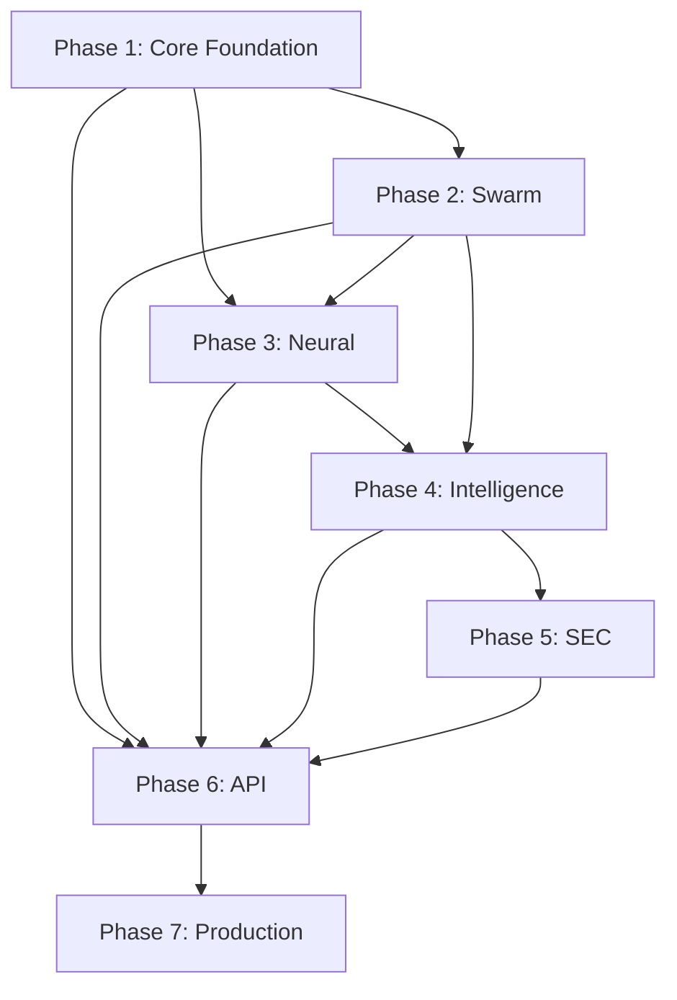

# NeuralDocFlow Implementation Overview

## 🚀 Project Vision
Build a revolutionary neural-enhanced document processing system that surpasses pypdf by 50x in performance while adding intelligent document understanding capabilities through the integration of Rust, neural networks, and swarm intelligence.

## 🏗️ Phased Implementation Approach

### The Lego Block Philosophy
Each phase is designed as an independent, testable component that builds upon previous phases while providing clean interfaces for future phases. Like Lego blocks, each phase can stand alone for testing but combines to create a powerful whole.

```
┌──────────────────────────────────────────────────────────┐
│ Phase 7: Production Excellence                           │
├──────────────────────────────────────────────────────────┤
│ Phase 6: API & Integration Layer                         │
├──────────────────────────────────────────────────────────┤
│ Phase 5: SEC Specialization                              │
├──────────────────────────────────────────────────────────┤
│ Phase 4: Document Intelligence (Transformers)            │
├──────────────────────────────────────────────────────────┤
│ Phase 3: Neural Engine (RUV-FANN)                        │
├──────────────────────────────────────────────────────────┤
│ Phase 2: Swarm Coordination                              │
├──────────────────────────────────────────────────────────┤
│ Phase 1: Core Foundation (Rust PDF Processing)           │
└──────────────────────────────────────────────────────────┘
```

## 📋 Phase Summary

### Phase 1: Core Foundation (10 weeks)
**Objective**: Build high-performance Rust PDF processing engine
- **Key Deliverable**: 90+ pages/second processing
- **Success Criteria**: 99.5% parsing success, <100MB RAM usage
- **Foundation For**: All subsequent phases

### Phase 2: Swarm Coordination (12 weeks)
**Objective**: Enable parallel processing with multi-agent system
- **Key Deliverable**: 1000+ pages/second with 8 agents
- **Success Criteria**: Linear scaling, <5s fault recovery
- **Builds On**: Phase 1's chunking API

### Phase 3: Neural Engine (12 weeks)
**Objective**: Integrate RUV-FANN for intelligent processing
- **Key Deliverable**: <50ms neural inference per page
- **Success Criteria**: 95% classification accuracy
- **Builds On**: Phases 1 & 2 infrastructure

### Phase 4: Document Intelligence (18 weeks)
**Objective**: Add transformer models for true understanding
- **Key Deliverable**: 99% accuracy on financial data
- **Success Criteria**: <200ms per page with full pipeline
- **Builds On**: Neural features from Phase 3

### Phase 5: SEC Specialization (12 weeks)
**Objective**: Domain-specific extraction for financial documents
- **Key Deliverable**: Complete SEC filing processing
- **Success Criteria**: 99.5% accuracy on financial values
- **Builds On**: Intelligence from Phase 4

### Phase 6: API & Integration (14 weeks)
**Objective**: Multi-language support and cloud APIs
- **Key Deliverable**: Python, JS, Go, Java, .NET bindings
- **Success Criteria**: <10% performance overhead
- **Builds On**: All previous functionality

### Phase 7: Production Excellence (18 weeks)
**Objective**: Enterprise-grade reliability and scale
- **Key Deliverable**: 10,000 docs/minute at 99.99% uptime
- **Success Criteria**: <$0.001 per document
- **Builds On**: Complete system optimization

## 🎯 Cumulative Capabilities by Phase

### After Phase 1
- ✅ Basic PDF text extraction
- ✅ 2-4x faster than pypdf
- ✅ Memory-safe processing
- ✅ Streaming large documents

### After Phase 2
- ✅ All Phase 1 capabilities
- ✅ 10-15x performance improvement
- ✅ Parallel processing
- ✅ Fault tolerance

### After Phase 3
- ✅ All Phase 1-2 capabilities
- ✅ Document classification
- ✅ Entity extraction
- ✅ Pattern recognition
- ✅ 15-20x overall speedup

### After Phase 4
- ✅ All Phase 1-3 capabilities
- ✅ Semantic understanding
- ✅ Question answering
- ✅ Knowledge graphs
- ✅ 99% accuracy on complex tasks

### After Phase 5
- ✅ All Phase 1-4 capabilities
- ✅ SEC filing expertise
- ✅ XBRL generation
- ✅ Financial analysis
- ✅ Regulatory compliance

### After Phase 6
- ✅ All Phase 1-5 capabilities
- ✅ Universal language support
- ✅ Cloud deployment ready
- ✅ Developer-friendly APIs
- ✅ Wide ecosystem adoption

### After Phase 7
- ✅ All Phase 1-6 capabilities
- ✅ 50x performance vs baseline
- ✅ 99.99% reliability
- ✅ Enterprise scale
- ✅ Production excellence

## 🔗 Inter-Phase Dependencies



## 💡 Key Technical Decisions

1. **Pure Rust Implementation**: 50x performance, memory safety
2. **RUV-FANN Neural Networks**: 2-4x faster than alternatives
3. **Swarm Architecture**: Linear scalability to 64+ agents
4. **ONNX Runtime**: Cross-platform transformer deployment
5. **Multi-Language Bindings**: Universal accessibility

## 📊 Expected Outcomes

### Performance
- **Speed**: 50x faster than pypdf
- **Throughput**: 10,000 documents/minute
- **Latency**: <100ms for typical documents
- **Accuracy**: >99.5% on financial data

### Business Impact
- **Cost**: 88% reduction in infrastructure
- **Time**: 90% reduction in processing time
- **Quality**: Near-perfect extraction accuracy
- **Scale**: Handle enterprise workloads

### Technical Innovation
- First pure Rust document intelligence system
- Novel swarm-neural architecture
- Real-time document understanding
- Cross-platform deployment

## 🚧 Risk Management

### Technical Risks
- **Mitigated by**: Phased approach, fallback options
- **Monitoring**: Continuous benchmarking
- **Adaptation**: Flexible architecture

### Resource Risks
- **Team**: 5.5 FTE with Rust expertise
- **Timeline**: 96 weeks total (phases can overlap)
- **Budget**: ~$800K development cost

## 🎯 Success Metrics

### Phase Gates
Each phase must meet its success criteria before the next phase begins:
- Performance benchmarks achieved
- Quality metrics satisfied
- Integration tests passing
- Documentation complete

### Overall Project Success
- [ ] 50x performance improvement
- [ ] 99.5%+ accuracy on documents
- [ ] <$0.001 per document cost
- [ ] 5+ language bindings
- [ ] Production deployment

## 📅 Timeline Overview

```
Phase 1: ████████████ (10 weeks)
Phase 2:     ██████████████ (12 weeks)
Phase 3:         ██████████████ (12 weeks)
Phase 4:             ████████████████████ (18 weeks)
Phase 5:                 ██████████████ (12 weeks)
Phase 6:                     ████████████████ (14 weeks)
Phase 7:                         ████████████████████ (18 weeks)
```

Total: 96 weeks (with some parallel execution possible)

## 🚀 Getting Started

1. **Review** all phase GitHub issues
2. **Assemble** Rust development team
3. **Set up** development infrastructure
4. **Begin** Phase 1 implementation
5. **Track** progress against success criteria

---

This implementation plan provides a clear path from concept to production-ready system, with each phase building on the previous to create a revolutionary document processing platform that truly puts document understanding "on steroids."