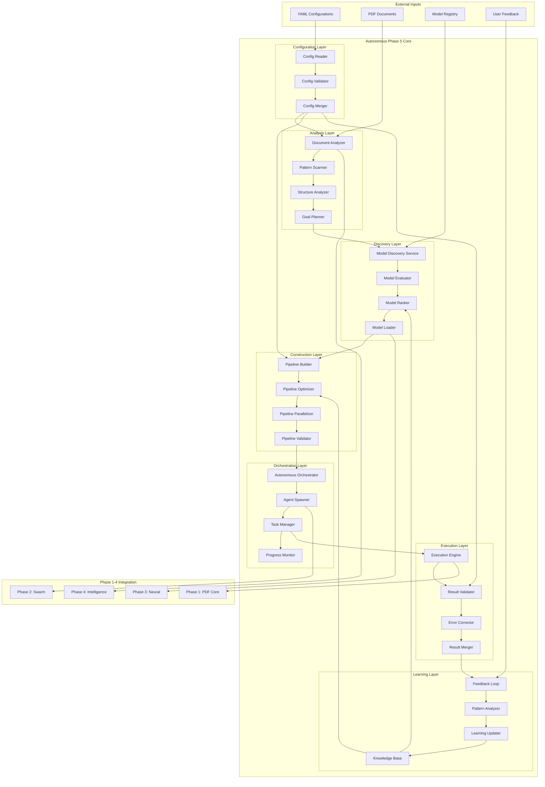
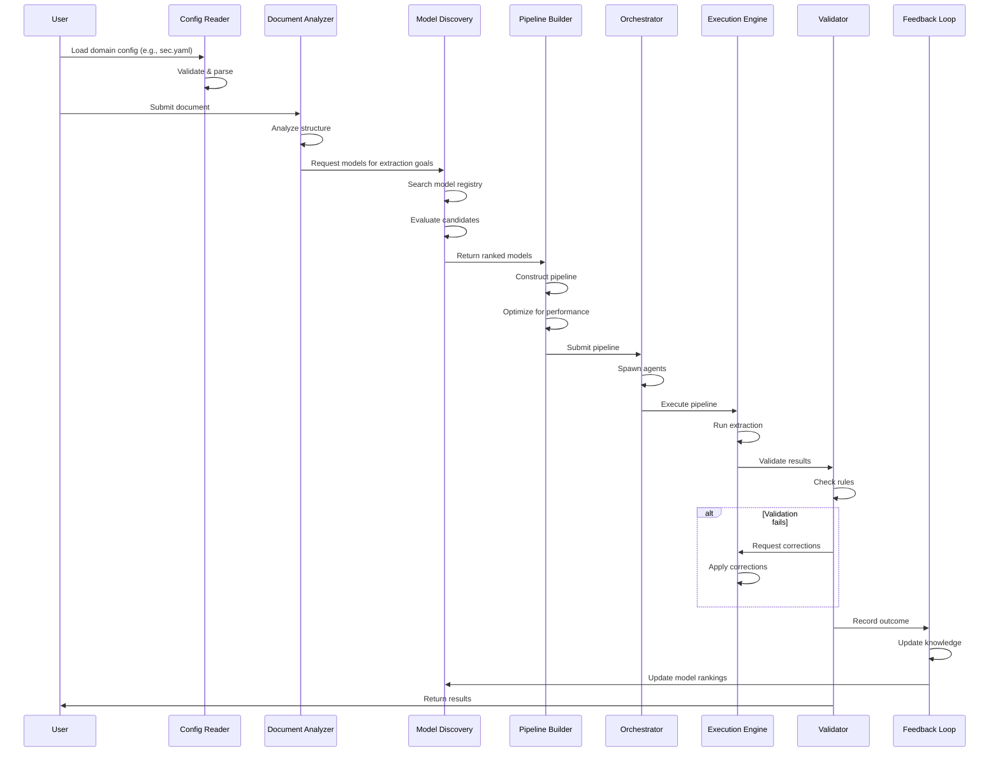
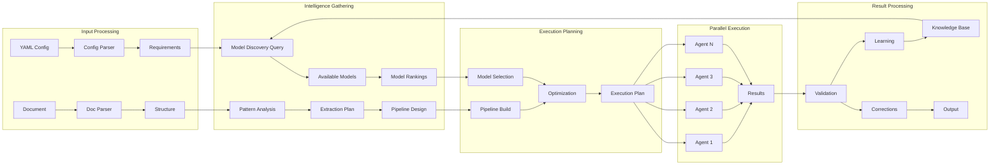
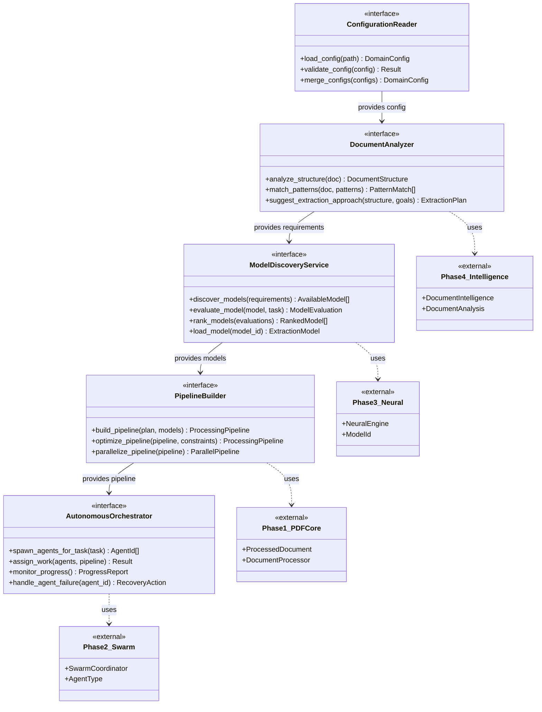
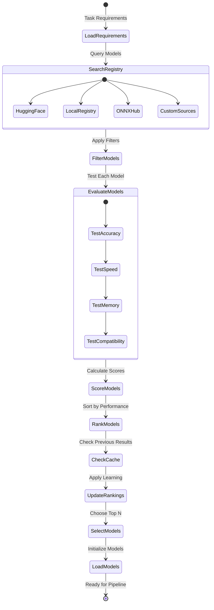
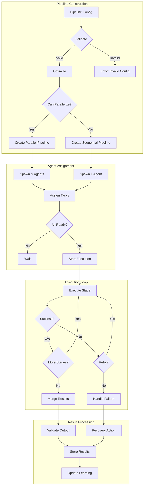
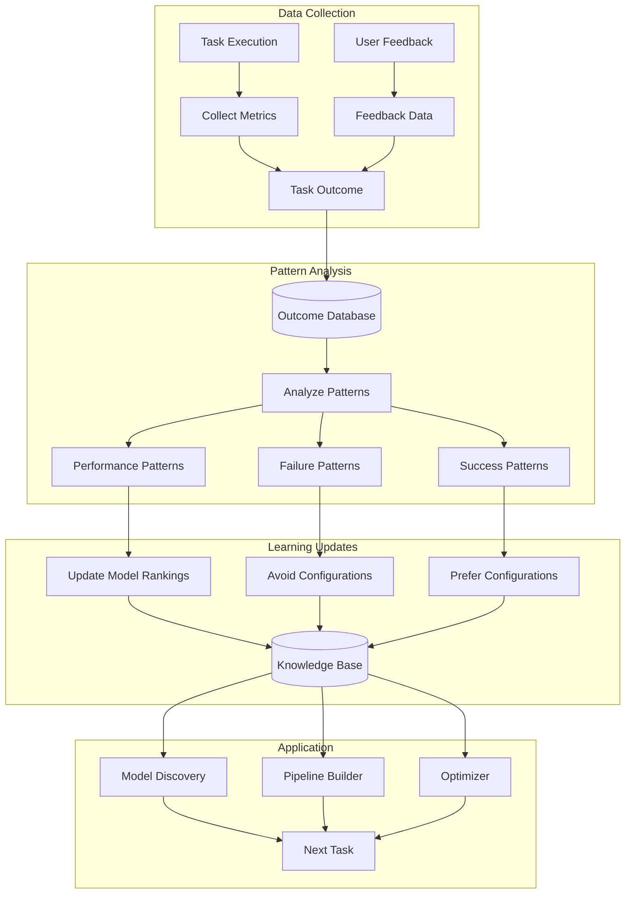
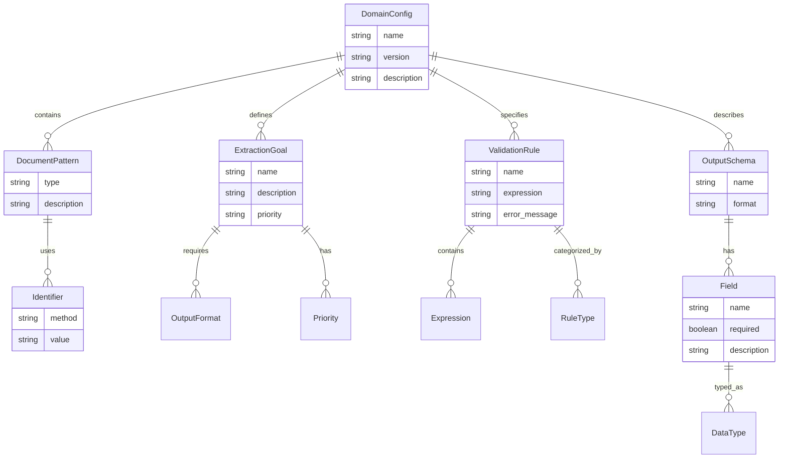
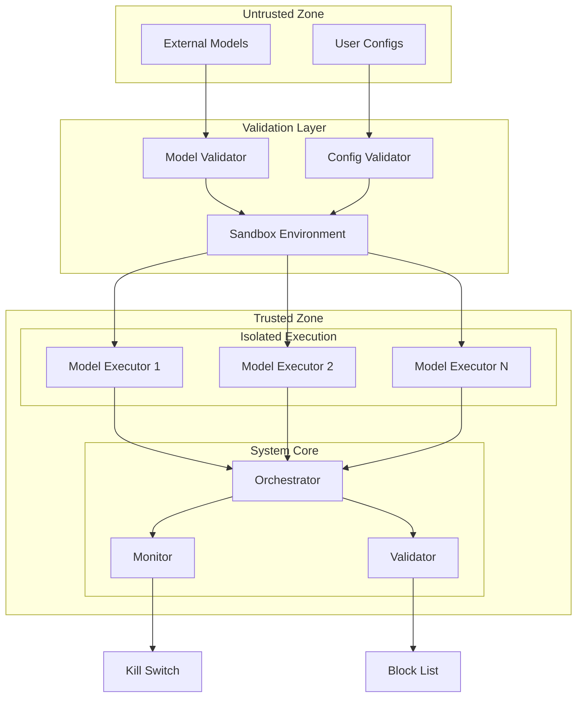
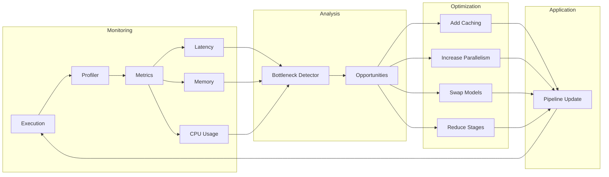

# Autonomous Document Architecture - Component Diagrams

## 🏗️ System Architecture Diagram

## 📊 Data Flow Diagram

## 🔄 Component Interaction Diagram

## 🧩 Interface Connectivity Diagram

## 🔍 Model Discovery Flow

## 🏃 Pipeline Execution Flow

## 🧠 Learning Feedback Loop

## 📋 Configuration Schema Diagram

## 🔐 Security & Isolation Diagram

## 📈 Performance Optimization Flow

## 🎯 Summary

These diagrams illustrate how the autonomous document processing architecture:

1. **Eliminates domain-specific code** through configuration-driven design
2. **Discovers and evaluates models** dynamically based on task requirements
3. **Constructs optimal pipelines** at runtime for each document type
4. **Learns from experience** to improve future performance
5. **Integrates seamlessly** with existing Phases 1-4
6. **Scales horizontally** through parallel agent execution
7. **Maintains security** through sandboxed model execution
8. **Optimizes continuously** based on performance metrics

The system achieves true autonomy by treating all document types generically, with specialization coming entirely from external configurations and learned patterns.