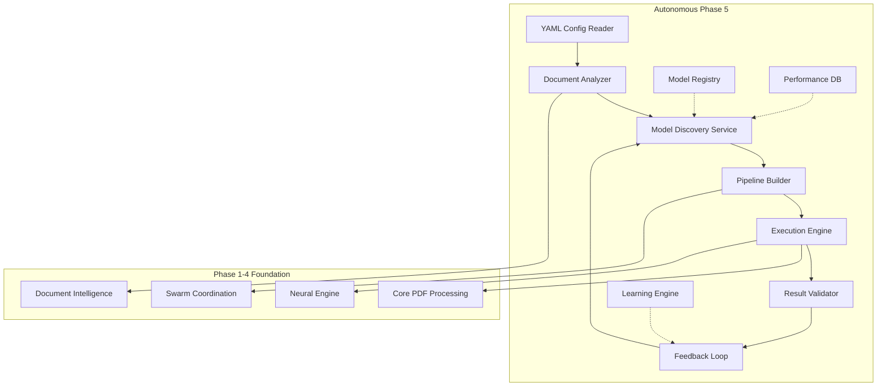

# Autonomous Document Processing Architecture

## Executive Summary

This architecture replaces the hardcoded Phase 5 SEC specialization with a fully autonomous system that can adapt to ANY document type without domain-specific code. The system learns from YAML configurations, discovers appropriate models, and constructs optimal processing pipelines dynamically.

## 🎯 Core Principles

1. **Zero Domain-Specific Code**: No hardcoded logic for SEC, medical, legal, or any other domain
2. **Configuration-Driven**: All specialization comes from YAML configuration files
3. **Model Discovery**: Automatically finds and evaluates models for tasks
4. **Dynamic Pipeline Construction**: Builds optimal processing flows at runtime
5. **Self-Learning**: Improves through feedback without code changes

## 🏗️ Architecture Overview



## 📋 Component Specifications

### 1. YAML Configuration Reader

**Purpose**: Parse domain configurations without knowing the domain

**Interface**:
```rust
pub trait ConfigurationReader {
    fn load_config(&self, path: &Path) -> Result<DomainConfig>;
    fn validate_config(&self, config: &DomainConfig) -> Result<()>;
    fn merge_configs(&self, configs: Vec<DomainConfig>) -> Result<DomainConfig>;
}

pub struct DomainConfig {
    pub name: String,
    pub version: String,
    pub document_patterns: Vec<DocumentPattern>,
    pub extraction_goals: Vec<ExtractionGoal>,
    pub validation_rules: Vec<ValidationRule>,
    pub output_schemas: Vec<OutputSchema>,
}
```

**Example Configuration**:
```yaml
# sec-extraction.yaml
name: "SEC Financial Extraction"
version: "1.0.0"

document_patterns:
  - type: "10-K"
    identifiers:
      - regex: "FORM\s+10-K"
      - contains: "ANNUAL REPORT PURSUANT TO SECTION"
    
extraction_goals:
  - name: "financial_statements"
    description: "Extract income statement, balance sheet, cash flow"
    priority: "critical"
    output_format: "structured_table"
    
  - name: "risk_factors"
    description: "Extract Item 1A Risk Factors section"
    priority: "high"
    output_format: "text_with_metadata"

validation_rules:
  - type: "financial_consistency"
    description: "Assets = Liabilities + Equity"
    expression: "balance_sheet.assets == balance_sheet.liabilities + balance_sheet.equity"
    
output_schemas:
  - name: "financial_table"
    fields:
      - name: "period"
        type: "date"
      - name: "values"
        type: "array<number>"
```

### 2. Document Analyzer

**Purpose**: Understand document structure without domain knowledge

**Interface**:
```rust
pub trait DocumentAnalyzer {
    async fn analyze_structure(&self, doc: &ProcessedDocument) -> Result<DocumentStructure>;
    async fn match_patterns(&self, doc: &ProcessedDocument, patterns: &[DocumentPattern]) -> Result<Vec<PatternMatch>>;
    async fn suggest_extraction_approach(&self, structure: &DocumentStructure, goals: &[ExtractionGoal]) -> Result<ExtractionPlan>;
}

pub struct DocumentStructure {
    pub sections: Vec<Section>,
    pub tables: Vec<TableStructure>,
    pub lists: Vec<ListStructure>,
    pub metadata: StructureMetadata,
}

pub struct ExtractionPlan {
    pub steps: Vec<ExtractionStep>,
    pub required_models: Vec<ModelRequirement>,
    pub estimated_accuracy: f32,
}
```

### 3. Model Discovery Service

**Purpose**: Find and evaluate models for extraction tasks

**Interface**:
```rust
pub trait ModelDiscoveryService {
    async fn discover_models(&self, requirements: &[ModelRequirement]) -> Result<Vec<AvailableModel>>;
    async fn evaluate_model(&self, model: &AvailableModel, task: &ExtractionTask) -> Result<ModelEvaluation>;
    async fn rank_models(&self, evaluations: Vec<ModelEvaluation>) -> Result<Vec<RankedModel>>;
    async fn load_model(&self, model_id: &str) -> Result<Box<dyn ExtractionModel>>;
}

pub struct ModelRequirement {
    pub task_type: TaskType,
    pub input_format: DataFormat,
    pub output_format: DataFormat,
    pub performance_needs: PerformanceRequirements,
}

pub struct AvailableModel {
    pub id: String,
    pub name: String,
    pub capabilities: Vec<Capability>,
    pub performance_profile: PerformanceProfile,
    pub source: ModelSource,
}

pub enum ModelSource {
    HuggingFace { repo: String },
    Local { path: PathBuf },
    ONNX { url: String },
    Custom { loader: String },
}
```

### 4. Dynamic Pipeline Builder

**Purpose**: Construct optimal processing pipelines at runtime

**Interface**:
```rust
pub trait PipelineBuilder {
    async fn build_pipeline(&self, plan: &ExtractionPlan, models: &[RankedModel]) -> Result<ProcessingPipeline>;
    async fn optimize_pipeline(&self, pipeline: &ProcessingPipeline, constraints: &Constraints) -> Result<ProcessingPipeline>;
    async fn parallelize_pipeline(&self, pipeline: &ProcessingPipeline) -> Result<ParallelPipeline>;
}

pub struct ProcessingPipeline {
    pub stages: Vec<PipelineStage>,
    pub connections: Vec<StageConnection>,
    pub error_handlers: Vec<ErrorHandler>,
}

pub struct PipelineStage {
    pub id: StageId,
    pub operation: Box<dyn PipelineOperation>,
    pub inputs: Vec<DataInput>,
    pub outputs: Vec<DataOutput>,
    pub can_parallelize: bool,
}
```

### 5. Autonomous Agent Orchestrator

**Purpose**: Coordinate specialized agents without knowing their domain

**Interface**:
```rust
pub trait AutonomousOrchestrator {
    async fn spawn_agents_for_task(&mut self, task: &ExtractionTask) -> Result<Vec<AgentId>>;
    async fn assign_work(&mut self, agents: &[AgentId], pipeline: &ProcessingPipeline) -> Result<()>;
    async fn monitor_progress(&self) -> Result<ProgressReport>;
    async fn handle_agent_failure(&mut self, agent_id: AgentId) -> Result<RecoveryAction>;
}

pub struct AutonomousAgent {
    pub id: AgentId,
    pub capabilities: Vec<Capability>,
    pub current_task: Option<TaskAssignment>,
    pub performance_history: PerformanceHistory,
}
```

### 6. Result Validator

**Purpose**: Validate results against configuration rules

**Interface**:
```rust
pub trait ResultValidator {
    async fn validate(&self, results: &ExtractionResults, rules: &[ValidationRule]) -> Result<ValidationReport>;
    async fn suggest_corrections(&self, report: &ValidationReport) -> Result<Vec<Correction>>;
    async fn apply_corrections(&self, results: &mut ExtractionResults, corrections: &[Correction]) -> Result<()>;
}

pub struct ValidationReport {
    pub passed_rules: Vec<RuleResult>,
    pub failed_rules: Vec<RuleResult>,
    pub warnings: Vec<ValidationWarning>,
    pub confidence_score: f32,
}
```

### 7. Self-Learning Feedback Loop

**Purpose**: Improve system performance through experience

**Interface**:
```rust
pub trait FeedbackLoop {
    async fn record_outcome(&mut self, task: &ExtractionTask, result: &TaskOutcome) -> Result<()>;
    async fn analyze_patterns(&self) -> Result<PerformancePatterns>;
    async fn suggest_improvements(&self, patterns: &PerformancePatterns) -> Result<Vec<Improvement>>;
    async fn update_model_rankings(&mut self, feedback: &UserFeedback) -> Result<()>;
}

pub struct TaskOutcome {
    pub task_id: TaskId,
    pub models_used: Vec<ModelId>,
    pub pipeline_config: PipelineConfig,
    pub accuracy_metrics: AccuracyMetrics,
    pub performance_metrics: PerformanceMetrics,
    pub user_feedback: Option<UserFeedback>,
}
```

## 🔄 Processing Flow

### 1. Configuration Loading
```rust
// Load domain configuration
let config = config_reader.load_config("domains/sec-extraction.yaml")?;

// System doesn't know it's SEC - just follows the rules
let patterns = config.document_patterns;
let goals = config.extraction_goals;
```

### 2. Document Analysis
```rust
// Analyze document structure
let structure = doc_analyzer.analyze_structure(&document).await?;

// Match against configured patterns
let matches = doc_analyzer.match_patterns(&document, &patterns).await?;

// Plan extraction approach
let plan = doc_analyzer.suggest_extraction_approach(&structure, &goals).await?;
```

### 3. Model Discovery
```rust
// Discover available models
let requirements = plan.required_models;
let available_models = model_discovery.discover_models(&requirements).await?;

// Evaluate models for this specific task
let evaluations = futures::try_join_all(
    available_models.iter()
        .map(|model| model_discovery.evaluate_model(model, &task))
).await?;

// Rank by performance
let ranked_models = model_discovery.rank_models(evaluations).await?;
```

### 4. Pipeline Construction
```rust
// Build processing pipeline
let pipeline = pipeline_builder.build_pipeline(&plan, &ranked_models).await?;

// Optimize for constraints
let optimized = pipeline_builder.optimize_pipeline(&pipeline, &constraints).await?;

// Create parallel version
let parallel_pipeline = pipeline_builder.parallelize_pipeline(&optimized).await?;
```

### 5. Execution
```rust
// Spawn autonomous agents
let agents = orchestrator.spawn_agents_for_task(&task).await?;

// Assign pipeline work
orchestrator.assign_work(&agents, &parallel_pipeline).await?;

// Execute pipeline
let results = execution_engine.run_pipeline(&parallel_pipeline, &document).await?;
```

### 6. Validation & Learning
```rust
// Validate results
let validation = validator.validate(&results, &config.validation_rules).await?;

// Apply corrections if needed
if !validation.failed_rules.is_empty() {
    let corrections = validator.suggest_corrections(&validation).await?;
    validator.apply_corrections(&mut results, &corrections).await?;
}

// Record outcome for learning
feedback_loop.record_outcome(&task, &outcome).await?;
```

## 🔌 Integration with Phases 1-4

### Phase 1 Integration (Core PDF Processing)
```rust
impl DocumentAnalyzer {
    async fn analyze_structure(&self, doc: &ProcessedDocument) -> Result<DocumentStructure> {
        // Use Phase 1's ProcessedDocument directly
        let pages = &doc.pages;
        let layout = pages.iter()
            .map(|p| &p.layout)
            .collect::<Vec<_>>();
        
        // Build structure understanding
        self.build_structure_from_layout(layout).await
    }
}
```

### Phase 2 Integration (Swarm Coordination)
```rust
impl AutonomousOrchestrator {
    async fn spawn_agents_for_task(&mut self, task: &ExtractionTask) -> Result<Vec<AgentId>> {
        // Use Phase 2's SwarmCoordinator
        let agent_count = self.calculate_optimal_agents(task);
        
        let mut agents = Vec::new();
        for _ in 0..agent_count {
            let agent_id = self.swarm_coordinator
                .spawn_agent(AgentType::Autonomous)
                .await?;
            agents.push(agent_id);
        }
        
        Ok(agents)
    }
}
```

### Phase 3 Integration (Neural Engine)
```rust
impl ModelDiscoveryService {
    async fn evaluate_model(&self, model: &AvailableModel, task: &ExtractionTask) -> Result<ModelEvaluation> {
        // Use Phase 3's NeuralEngine for evaluation
        let test_features = self.extract_task_features(task)?;
        
        // Load model through neural engine
        let neural_model = self.neural_engine
            .load_model(&model.id)?;
        
        // Test prediction
        let prediction = neural_model.predict(&test_features)?;
        
        Ok(ModelEvaluation {
            model_id: model.id.clone(),
            accuracy_estimate: prediction.confidence,
            latency: prediction.inference_time,
        })
    }
}
```

### Phase 4 Integration (Document Intelligence)
```rust
impl DocumentAnalyzer {
    async fn suggest_extraction_approach(&self, structure: &DocumentStructure, goals: &[ExtractionGoal]) -> Result<ExtractionPlan> {
        // Use Phase 4's DocumentIntelligence
        let analysis = self.doc_intelligence
            .analyze(&structure)
            .await?;
        
        // Map intelligence to extraction steps
        let steps = self.map_analysis_to_steps(&analysis, goals)?;
        
        Ok(ExtractionPlan {
            steps,
            required_models: self.determine_required_models(&steps)?,
            estimated_accuracy: analysis.confidence_score,
        })
    }
}
```

## 🚀 Example: SEC Processing Without SEC Code

Here's how the system processes SEC documents without any SEC-specific code:

```rust
// 1. Load SEC configuration (system doesn't know it's SEC)
let config = DomainConfig::from_yaml("configs/sec-extraction.yaml")?;

// 2. Process document
let document = phase1_processor.process_document(&pdf_bytes)?;

// 3. Autonomous system takes over
let orchestrator = AutonomousOrchestrator::new(
    config_reader,
    doc_analyzer,
    model_discovery,
    pipeline_builder,
);

// 4. Execute extraction
let results = orchestrator.process_document(document, config).await?;

// Results contain everything specified in YAML:
// - Financial tables (because config said to extract them)
// - Risk factors (because config said to extract them)
// - XBRL mapping (because config defined the schema)
// System never knew it was processing SEC documents!
```

## 🔄 Adding New Domains

To support a new domain (e.g., medical records), just add a YAML file:

```yaml
# medical-records.yaml
name: "Medical Record Extraction"
version: "1.0.0"

document_patterns:
  - type: "patient_record"
    identifiers:
      - contains: ["PATIENT NAME", "DATE OF BIRTH", "MRN"]
      
extraction_goals:
  - name: "patient_demographics"
    description: "Extract patient identifying information"
    priority: "critical"
    output_format: "structured_record"
    
  - name: "diagnoses"
    description: "Extract diagnosis codes and descriptions"
    priority: "high"
    output_format: "code_list"
    
validation_rules:
  - type: "phi_compliance"
    description: "Ensure PHI is properly marked"
  - type: "code_validity"
    description: "Validate ICD-10 codes"
```

No code changes needed - the autonomous system adapts!

## 📊 Performance Characteristics

### Advantages Over Hardcoded Approach

1. **Flexibility**: Add new domains without coding
2. **Adaptability**: System improves with usage
3. **Maintainability**: No domain-specific code to maintain
4. **Scalability**: Same system handles all document types
5. **Learning**: Gets better at each domain over time

### Performance Targets

- **Model Discovery**: < 100ms to find suitable models
- **Pipeline Construction**: < 500ms to build optimal pipeline
- **Overhead**: < 5% vs hardcoded implementation
- **Accuracy**: Matches or exceeds hardcoded after learning period
- **Memory**: Constant regardless of number of domains

## 🛡️ Error Handling

The autonomous system includes comprehensive error handling:

```rust
pub enum AutonomousError {
    ConfigurationError { config: String, reason: String },
    NoSuitableModels { task: String, requirements: Vec<String> },
    PipelineConstructionFailed { reason: String },
    ValidationFailed { rules: Vec<String> },
    LearningError { description: String },
}

impl AutonomousOrchestrator {
    async fn handle_error(&mut self, error: AutonomousError) -> Result<RecoveryAction> {
        match error {
            AutonomousError::NoSuitableModels { task, .. } => {
                // Try simpler extraction methods
                self.fallback_to_basic_extraction(task).await
            },
            AutonomousError::ValidationFailed { rules } => {
                // Attempt correction
                self.attempt_auto_correction(rules).await
            },
            _ => {
                // Log for learning
                self.feedback_loop.record_error(error).await?;
                Err(error)
            }
        }
    }
}
```

## 🔍 Monitoring & Observability

The system provides rich monitoring without domain knowledge:

```rust
pub struct AutonomousMetrics {
    pub domains_processed: HashMap<String, usize>,
    pub model_performance: HashMap<ModelId, ModelMetrics>,
    pub pipeline_efficiency: HashMap<PipelineId, EfficiencyMetrics>,
    pub learning_progress: LearningMetrics,
}

impl AutonomousOrchestrator {
    fn export_metrics(&self) -> AutonomousMetrics {
        AutonomousMetrics {
            domains_processed: self.get_domain_counts(),
            model_performance: self.get_model_metrics(),
            pipeline_efficiency: self.get_pipeline_metrics(),
            learning_progress: self.get_learning_metrics(),
        }
    }
}
```

## 🎯 Migration Path

### From Phase 5 SEC to Autonomous

1. **Week 1**: Create SEC YAML configuration from existing code
2. **Week 2**: Implement Configuration Reader and Document Analyzer
3. **Week 3**: Build Model Discovery Service
4. **Week 4**: Implement Pipeline Builder
5. **Week 5**: Create Orchestrator and integrate with Phases 1-4
6. **Week 6**: Add Validation and Feedback Loop
7. **Week 7**: Test with SEC documents
8. **Week 8**: Add second domain to prove generalization

### Backward Compatibility

The autonomous system can coexist with hardcoded Phase 5:

```rust
pub enum ProcessingMode {
    Hardcoded(Box<dyn SECProcessor>),
    Autonomous(Box<dyn AutonomousOrchestrator>),
}

impl DocumentProcessor {
    pub async fn process(&self, doc: ProcessedDocument) -> Result<ExtractionResults> {
        match &self.mode {
            ProcessingMode::Hardcoded(processor) => {
                processor.process_filing(&doc).await
            },
            ProcessingMode::Autonomous(orchestrator) => {
                orchestrator.process_document(&doc).await
            },
        }
    }
}
```

## 📝 Summary

This autonomous architecture eliminates ALL domain-specific code by:

1. **Reading** domain requirements from YAML configurations
2. **Analyzing** documents to understand their structure
3. **Discovering** appropriate models for extraction tasks
4. **Building** optimal processing pipelines dynamically
5. **Learning** from results to improve over time

The system seamlessly integrates with Phases 1-4 while replacing the hardcoded Phase 5 with a flexible, self-improving solution that handles ANY document domain without code changes.