# NeuralDocFlow Dependency Graph and Build Order

## Build Dependency Tree

```mermaid
graph TD
    %% Core Foundation Layer
    subgraph "Foundation Layer (Week 1)"
        CORE[neuraldocflow-core<br/>Core types & traits]
        MEM[Memory Management<br/>Pool & Allocators]
        ERR[Error Handling<br/>Custom error types]
    end
    
    %% Base Modules
    subgraph "Base Modules (Week 2)"
        PDF[neuraldocflow-pdf<br/>PDF Parser]
        UTIL[neuraldocflow-utils<br/>Common utilities]
    end
    
    %% Neural Layer
    subgraph "Neural Integration (Week 3-4)"
        NEURAL[neuraldocflow-neural<br/>Neural Processing]
        ONNX[ONNX Runtime<br/>Integration]
        FANN[RUV-FANN<br/>Integration]
        TOK[Tokenizers<br/>Integration]
    end
    
    %% Coordination Layer
    subgraph "Swarm Coordination (Week 5-6)"
        SWARM[neuraldocflow-swarm<br/>Agent Coordination]
        ASYNC[Async Runtime<br/>Tokio Integration]
        COMM[Communication<br/>Channels & Messages]
    end
    
    %% Output Layer
    subgraph "Output & Integration (Week 7)"
        OUT[neuraldocflow-output<br/>Serialization]
        API[neuraldocflow-api<br/>REST/CLI Interface]
    end
    
    %% Performance Layer
    subgraph "Optimization (Week 8)"
        SIMD[SIMD Operations<br/>AVX2/AVX512]
        GPU[GPU Acceleration<br/>CUDA/TensorRT]
        CACHE[Caching Layer<br/>LRU & Embeddings]
    end
    
    %% Dependencies
    CORE --> MEM
    CORE --> ERR
    
    PDF --> CORE
    PDF --> MEM
    PDF --> SIMD
    
    NEURAL --> CORE
    NEURAL --> ONNX
    NEURAL --> FANN
    NEURAL --> TOK
    NEURAL --> GPU
    NEURAL --> CACHE
    
    SWARM --> CORE
    SWARM --> ASYNC
    SWARM --> COMM
    
    OUT --> CORE
    API --> NEURAL
    API --> SWARM
    API --> OUT
    
    %% External Dependencies
    ONNX -.-> |external| ONNXRT[ort crate v1.16]
    FANN -.-> |external| RUVFANN[ruv-fann v0.3]
    TOK -.-> |external| TOKENIZERS[tokenizers v0.15]
    ASYNC -.-> |external| TOKIO[tokio v1.35]
    PDF -.-> |external| MEMMAP[memmap2 v0.9]
    PDF -.-> |external| RAYON[rayon v1.8]
    
    style CORE fill:#f9f,stroke:#333,stroke-width:4px
    style NEURAL fill:#bbf,stroke:#333,stroke-width:4px
    style SWARM fill:#bfb,stroke:#333,stroke-width:4px
    style PDF fill:#fbf,stroke:#333,stroke-width:4px
```



## Detailed Component Dependencies

### 1. Core Foundation (`neuraldocflow-core`)
**Must be built first**

```toml
[dependencies]
# Error handling
thiserror = "1.0"
anyhow = "1.0"

# Serialization
serde = { version = "1.0", features = ["derive"] }

# Async traits
async-trait = "0.1"

# Metrics
metrics = "0.22"

# Logging
tracing = "0.1"
```

### 2. PDF Parser (`neuraldocflow-pdf`)
**Depends on: core**

```toml
[dependencies]
neuraldocflow-core = { path = "../core" }

# PDF parsing
lopdf = "0.31"
pdf-extract = "0.7"

# Memory mapping
memmap2 = "0.9"

# Parallel processing
rayon = "1.8"

# Image processing
image = "0.24"

# SIMD
wide = "0.7"
```

### 3. Neural Processing (`neuraldocflow-neural`)
**Depends on: core**

```toml
[dependencies]
neuraldocflow-core = { path = "../core" }

# ONNX Runtime
ort = { version = "1.16", features = ["cuda", "tensorrt"] }

# Tokenizers
tokenizers = "0.15"

# Neural networks
ruv-fann = "0.3"

# Linear algebra
ndarray = "0.15"

# Caching
lru = "0.12"
dashmap = "5.5"
```

### 4. Swarm Coordination (`neuraldocflow-swarm`)
**Depends on: core**

```toml
[dependencies]
neuraldocflow-core = { path = "../core" }

# Async runtime
tokio = { version = "1.35", features = ["full"] }

# Channels
crossbeam-channel = "0.5"
flume = "0.11"

# Synchronization
parking_lot = "0.12"
arc-swap = "1.6"

# UUID generation
uuid = { version = "1.6", features = ["v4"] }
```

### 5. Output Serialization (`neuraldocflow-output`)
**Depends on: core**

```toml
[dependencies]
neuraldocflow-core = { path = "../core" }

# Serialization formats
serde_json = "1.0"
serde_cbor = "0.11"
rmp-serde = "1.1"

# Compression
zstd = "0.13"
lz4 = "1.24"
snap = "1.1"

# Parquet support
arrow = "49.0"
parquet = "49.0"
```

### 6. API Layer (`neuraldocflow-api`)
**Depends on: all modules**

```toml
[dependencies]
neuraldocflow-core = { path = "../core" }
neuraldocflow-pdf = { path = "../pdf" }
neuraldocflow-neural = { path = "../neural" }
neuraldocflow-swarm = { path = "../swarm" }
neuraldocflow-output = { path = "../output" }

# Web framework
axum = "0.7"
tower = "0.4"

# CLI
clap = { version = "4.4", features = ["derive"] }

# OpenAPI
utoipa = { version = "4.1", features = ["axum_extras"] }
```

## Integration Points and Interfaces

### 1. Core → PDF Interface
```rust
pub trait DocumentParser: Send + Sync {
    async fn parse(&self, input: &[u8]) -> Result<Document>;
    async fn parse_file(&self, path: &Path) -> Result<Document>;
    fn supports_format(&self, format: &str) -> bool;
}
```

### 2. Core → Neural Interface
```rust
pub trait NeuralProcessor: Send + Sync {
    async fn process(&self, doc: &Document) -> Result<EnrichedDocument>;
    async fn batch_process(&self, docs: Vec<Document>) -> Result<Vec<EnrichedDocument>>;
    fn model_info(&self) -> ModelInfo;
}
```

### 3. Core → Swarm Interface
```rust
pub trait SwarmCoordinator: Send + Sync {
    async fn spawn_agent(&self, role: AgentRole) -> Result<AgentId>;
    async fn distribute_task(&self, task: Task) -> Result<TaskHandle>;
    async fn get_status(&self) -> SwarmStatus;
}
```

### 4. Core → Output Interface
```rust
pub trait OutputSerializer: Send + Sync {
    async fn serialize(&self, doc: &ProcessedDocument) -> Result<Vec<u8>>;
    fn supported_formats(&self) -> Vec<OutputFormat>;
}
```

## Build Script Order

```bash
#!/bin/bash
# build.sh - Build NeuralDocFlow in correct order

echo "Building NeuralDocFlow..."

# 1. Build core first
echo "Building core..."
cd neuraldocflow-core && cargo build --release || exit 1

# 2. Build base modules in parallel
echo "Building base modules..."
(cd neuraldocflow-pdf && cargo build --release) &
(cd neuraldocflow-utils && cargo build --release) &
wait

# 3. Build neural and swarm in parallel
echo "Building neural and swarm modules..."
(cd neuraldocflow-neural && cargo build --release) &
(cd neuraldocflow-swarm && cargo build --release) &
(cd neuraldocflow-output && cargo build --release) &
wait

# 4. Build API last
echo "Building API..."
cd neuraldocflow-api && cargo build --release || exit 1

echo "Build complete!"
```

## Testing Order

### 1. Unit Tests (per module)
```bash
cargo test --package neuraldocflow-core
cargo test --package neuraldocflow-pdf
cargo test --package neuraldocflow-neural
cargo test --package neuraldocflow-swarm
cargo test --package neuraldocflow-output
```

### 2. Integration Tests
```bash
# Test module interactions
cargo test --test integration_tests

# Test end-to-end flows
cargo test --test e2e_tests
```

### 3. Performance Tests
```bash
# Run benchmarks
cargo bench --package neuraldocflow-core
cargo bench --package neuraldocflow-pdf
cargo bench --package neuraldocflow-neural
```

## Deployment Dependencies

### System Requirements
- **OS**: Linux (Ubuntu 20.04+, RHEL 8+)
- **CPU**: x86_64 with AVX2 support
- **RAM**: 8GB minimum, 16GB recommended
- **GPU**: NVIDIA GPU with CUDA 11.8+ (optional)

### Runtime Dependencies
```yaml
# docker-compose.yml
version: '3.8'

services:
  neuraldocflow:
    image: neuraldocflow:latest
    environment:
      - RUST_LOG=info
      - NEURAL_MODELS_PATH=/models
      - ENABLE_GPU=true
    volumes:
      - ./models:/models
      - ./data:/data
    deploy:
      resources:
        limits:
          memory: 16G
        reservations:
          devices:
            - driver: nvidia
              count: 1
              capabilities: [gpu]
```

## Dependency Version Matrix

| Component | Min Version | Recommended | Max Tested |
|-----------|-------------|-------------|------------|
| Rust | 1.70.0 | 1.75.0 | 1.75.0 |
| ONNX Runtime | 1.14.0 | 1.16.0 | 1.16.3 |
| CUDA | 11.8 | 12.0 | 12.3 |
| TensorRT | 8.5 | 8.6 | 8.6.1 |
| glibc | 2.31 | 2.35 | 2.38 |

## Critical Path Analysis

### Minimum Viable Product (MVP) Path:
1. **Week 1**: Core + Memory Management
2. **Week 2**: PDF Parser (basic)
3. **Week 3**: Neural Integration (ONNX only)
4. **Week 4**: Output Serialization (JSON only)
5. **Week 5**: Basic API

### Full Feature Path:
1. **Weeks 1-2**: Foundation + PDF Parser
2. **Weeks 3-4**: Complete Neural Integration
3. **Weeks 5-6**: Swarm Coordination
4. **Week 7**: Output Formats
5. **Week 8**: Performance Optimization
6. **Weeks 9-10**: Production Hardening

## Risk Mitigation in Dependencies

### 1. ONNX Runtime Issues
- **Mitigation**: Support multiple versions
- **Fallback**: Pure Rust inference for basic models

### 2. GPU Driver Compatibility
- **Mitigation**: Runtime detection and fallback
- **Fallback**: CPU-only processing

### 3. Memory Allocation Failures
- **Mitigation**: Graceful degradation
- **Fallback**: Streaming processing mode

This dependency graph ensures proper build order, identifies critical paths, and provides clear interfaces between components for the NeuralDocFlow system.