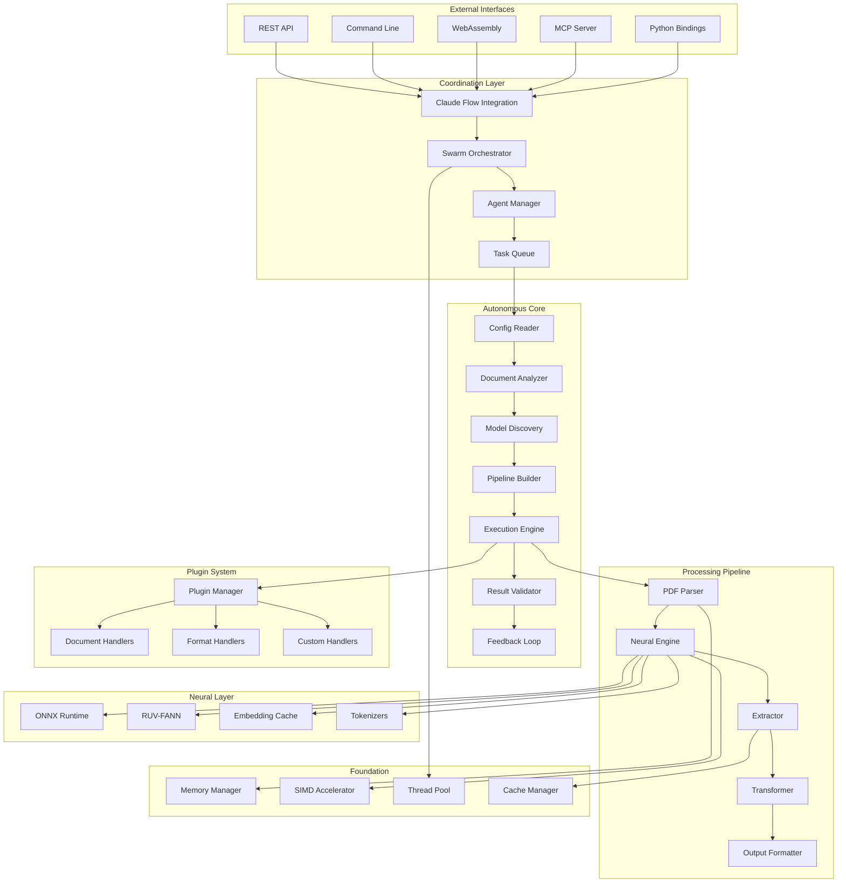

# Optimized Modular Architecture for Autonomous Document Extraction Platform

## 🎯 Executive Summary

This document presents the optimized modular architecture for NeuralDocFlow, synthesizing insights from existing autonomous system designs, pure Rust performance benefits, and Claude Flow coordination patterns. The architecture prioritizes modularity, performance, autonomy, and seamless integration with ruv-FANN neural networks.

## 🏗️ High-Level Architecture



## 📦 Module Specifications

### 1. Core Infrastructure Layer

#### 1.1 Memory Manager Module (`neuraldocflow-memory`)

**Purpose**: Zero-copy memory management with SIMD-optimized allocation

```rust
pub trait MemoryManager: Send + Sync {
    fn allocate_aligned(&self, size: usize, alignment: usize) -> Result<AlignedBuffer>;
    fn create_memory_pool(&self, pool_config: PoolConfig) -> Result<MemoryPool>;
    fn map_file(&self, path: &Path) -> Result<MemoryMappedFile>;
    fn create_shared_region(&self, size: usize) -> Result<SharedMemoryRegion>;
}

pub struct AlignedBuffer {
    ptr: NonNull<u8>,
    size: usize,
    alignment: usize,
    pool: Option<Arc<MemoryPool>>,
}

pub struct MemoryMappedFile {
    data: &'static [u8], // Lifetime managed by struct
    size: usize,
    read_only: bool,
}

// SIMD-optimized operations
impl MemoryManager {
    pub fn simd_copy(&self, src: &[u8], dst: &mut [u8]) -> Result<usize> {
        use std::arch::x86_64::*;
        if is_x86_feature_detected!("avx2") {
            unsafe { self.simd_copy_avx2(src, dst) }
        } else {
            dst.copy_from_slice(&src[..dst.len().min(src.len())]);
            Ok(dst.len().min(src.len()))
        }
    }
}
```

#### 1.2 SIMD Accelerator Module (`neuraldocflow-simd`)

**Purpose**: Hardware-accelerated text processing and neural operations

```rust
pub trait SIMDProcessor: Send + Sync {
    fn find_text_boundaries(&self, data: &[u8]) -> Vec<usize>;
    fn extract_words_parallel(&self, data: &[u8]) -> Vec<TextSpan>;
    fn compute_embeddings_batch(&self, inputs: &[&str]) -> Result<Vec<Vec<f32>>>;
    fn matrix_multiply_f32(&self, a: &[f32], b: &[f32], rows: usize, cols: usize) -> Vec<f32>;
}

#[cfg(target_arch = "x86_64")]
pub struct AVXProcessor {
    feature_support: CPUFeatures,
}

impl AVXProcessor {
    pub fn new() -> Self {
        Self {
            feature_support: CPUFeatures::detect(),
        }
    }
    
    pub unsafe fn find_patterns_avx512(&self, 
        haystack: &[u8], 
        needle: &[u8]
    ) -> Vec<usize> {
        use std::arch::x86_64::*;
        
        let mut matches = Vec::new();
        let needle_len = needle.len();
        
        if needle_len == 0 || haystack.len() < needle_len {
            return matches;
        }
        
        let first_char = _mm512_set1_epi8(needle[0] as i8);
        
        for i in (0..=haystack.len() - needle_len).step_by(64) {
            let chunk = _mm512_loadu_si512(haystack.as_ptr().add(i) as *const i32);
            let cmp = _mm512_cmpeq_epi8_mask(chunk, first_char);
            
            if cmp != 0 {
                for j in 0..64 {
                    if cmp & (1 << j) != 0 {
                        let pos = i + j;
                        if pos + needle_len <= haystack.len() &&
                           &haystack[pos..pos + needle_len] == needle {
                            matches.push(pos);
                        }
                    }
                }
            }
        }
        
        matches
    }
}
```

### 2. Document Processing Core

#### 2.1 Autonomous Configuration Reader (`neuraldocflow-config`)

**Purpose**: YAML-driven autonomous processing without domain-specific code

```rust
pub trait ConfigurationReader: Send + Sync {
    async fn load_config(&self, path: &Path) -> Result<DomainConfig>;
    async fn validate_config(&self, config: &DomainConfig) -> Result<ValidationReport>;
    async fn merge_configs(&self, configs: Vec<DomainConfig>) -> Result<DomainConfig>;
    async fn generate_config_from_example(&self, document: &Document) -> Result<DomainConfig>;
}

#[derive(Debug, Clone, Serialize, Deserialize)]
pub struct DomainConfig {
    pub name: String,
    pub version: String,
    pub document_patterns: Vec<DocumentPattern>,
    pub extraction_goals: Vec<ExtractionGoal>,
    pub validation_rules: Vec<ValidationRule>,
    pub output_schemas: Vec<OutputSchema>,
    pub neural_models: ModelConfiguration,
    pub performance_targets: PerformanceTargets,
}

#[derive(Debug, Clone, Serialize, Deserialize)]
pub struct ExtractionGoal {
    pub name: String,
    pub description: String,
    pub priority: Priority,
    pub target_elements: Vec<ElementSelector>,
    pub required_models: Vec<ModelRequirement>,
    pub confidence_threshold: f32,
    pub output_format: OutputFormat,
    pub validation_rules: Vec<String>,
}

// Example configuration for SEC filings
impl ConfigurationReader {
    pub async fn load_sec_config(&self) -> Result<DomainConfig> {
        // Loads from YAML file, system learns patterns automatically
        self.load_config(Path::new("configs/sec_extraction.yaml")).await
    }
}
```

#### 2.2 Document Analyzer (`neuraldocflow-analyzer`)

**Purpose**: Autonomous document structure understanding

```rust
pub trait DocumentAnalyzer: Send + Sync {
    async fn analyze_structure(&self, doc: &Document) -> Result<DocumentStructure>;
    async fn classify_document_type(&self, doc: &Document) -> Result<DocumentType>;
    async fn extract_layout_features(&self, doc: &Document) -> Result<LayoutFeatures>;
    async fn identify_content_blocks(&self, doc: &Document) -> Result<Vec<ContentBlock>>;
    async fn build_extraction_plan(&self, structure: &DocumentStructure, goals: &[ExtractionGoal]) -> Result<ExtractionPlan>;
}

pub struct DocumentStructure {
    pub document_type: DocumentType,
    pub page_count: usize,
    pub sections: Vec<Section>,
    pub tables: Vec<TableRegion>,
    pub figures: Vec<FigureRegion>,
    pub text_blocks: Vec<TextBlock>,
    pub layout_hierarchy: LayoutTree,
    pub confidence_scores: ConfidenceMap,
}

pub struct ExtractionPlan {
    pub stages: Vec<ExtractionStage>,
    pub required_models: Vec<ModelRequirement>,
    pub parallel_tasks: Vec<ParallelTask>,
    pub dependencies: Vec<StageDependency>,
    pub estimated_duration: Duration,
    pub memory_requirements: MemoryEstimate,
}

// Neural-powered analysis
impl DocumentAnalyzer {
    pub async fn analyze_with_layoutlm(&self, doc: &Document) -> Result<LayoutFeatures> {
        // Use LayoutLMv3 for spatial-semantic understanding
        let model = self.model_manager.get_model("layoutlmv3").await?;
        let features = model.extract_layout_features(doc).await?;
        Ok(features)
    }
    
    pub async fn classify_with_confidence(&self, doc: &Document) -> Result<(DocumentType, f32)> {
        // Multi-model classification with confidence scoring
        let classifiers = vec!["finbert", "layoutlm", "custom_classifier"];
        let mut results = Vec::new();
        
        for classifier in classifiers {
            let model = self.model_manager.get_model(&classifier).await?;
            let result = model.classify(doc).await?;
            results.push(result);
        }
        
        // Ensemble voting with confidence weighting
        let (doc_type, confidence) = self.ensemble_classify(results)?;
        Ok((doc_type, confidence))
    }
}
```

#### 2.3 Model Discovery Service (`neuraldocflow-discovery`)

**Purpose**: Automatic model selection and evaluation

```rust
pub trait ModelDiscoveryService: Send + Sync {
    async fn discover_models(&self, requirements: &[ModelRequirement]) -> Result<Vec<AvailableModel>>;
    async fn evaluate_model(&self, model: &AvailableModel, task: &ExtractionTask) -> Result<ModelEvaluation>;
    async fn rank_models(&self, evaluations: Vec<ModelEvaluation>) -> Result<Vec<RankedModel>>;
    async fn load_optimal_model(&self, task: &ExtractionTask) -> Result<Arc<dyn NeuralModel>>;
    async fn cache_model_results(&self, model_id: &str, input_hash: u64, results: &ModelOutput) -> Result<()>;
}

pub struct ModelEvaluation {
    pub model_id: String,
    pub accuracy_estimate: f32,
    pub latency_ms: u64,
    pub memory_usage_mb: u64,
    pub confidence_score: f32,
    pub capabilities_match: f32,
    pub cost_score: f32,
}

pub struct ModelRequirement {
    pub task_type: TaskType,
    pub input_format: DataFormat,
    pub output_format: DataFormat,
    pub min_accuracy: f32,
    pub max_latency_ms: u64,
    pub max_memory_mb: u64,
    pub required_capabilities: Vec<ModelCapability>,
}

// Model repository integration
impl ModelDiscoveryService {
    pub async fn discover_from_huggingface(&self, task: &TaskType) -> Result<Vec<AvailableModel>> {
        match task {
            TaskType::DocumentClassification => {
                self.query_hf_models("document-classification").await
            },
            TaskType::NamedEntityRecognition => {
                self.query_hf_models("token-classification").await
            },
            TaskType::TableExtraction => {
                self.query_hf_models("table-question-answering").await
            },
            TaskType::FinancialAnalysis => {
                self.get_finbert_variants().await
            }
        }
    }
    
    pub async fn benchmark_model(&self, model: &AvailableModel, test_docs: &[Document]) -> Result<BenchmarkResults> {
        let mut total_time = Duration::new(0, 0);
        let mut accuracy_scores = Vec::new();
        
        for doc in test_docs {
            let start = Instant::now();
            let result = model.process(doc).await?;
            let duration = start.elapsed();
            
            total_time += duration;
            if let Some(ground_truth) = doc.ground_truth.as_ref() {
                let accuracy = self.compute_accuracy(&result, ground_truth)?;
                accuracy_scores.push(accuracy);
            }
        }
        
        Ok(BenchmarkResults {
            avg_latency: total_time / test_docs.len() as u32,
            avg_accuracy: accuracy_scores.iter().sum::<f32>() / accuracy_scores.len() as f32,
            throughput: test_docs.len() as f32 / total_time.as_secs_f32(),
        })
    }
}
```

### 3. Neural Engine Integration

#### 3.1 Hybrid Neural Processor (`neuraldocflow-neural`)

**Purpose**: ONNX Runtime + RUV-FANN integration for optimal performance

```rust
pub trait NeuralProcessor: Send + Sync {
    async fn process_with_transformer(&self, input: &ProcessorInput) -> Result<TransformerOutput>;
    async fn process_with_fann(&self, input: &ProcessorInput) -> Result<FANNOutput>;
    async fn fuse_outputs(&self, transformer: TransformerOutput, fann: FANNOutput) -> Result<FusedOutput>;
    async fn train_fusion_layer(&mut self, training_data: &[TrainingExample]) -> Result<TrainingMetrics>;
}

pub struct HybridNeuralEngine {
    onnx_session_manager: Arc<ONNXSessionManager>,
    fann_network_manager: Arc<FANNNetworkManager>,
    fusion_network: Arc<RwLock<FusionNetwork>>,
    model_cache: Arc<ModelCache>,
    performance_monitor: Arc<PerformanceMonitor>,
}

impl HybridNeuralEngine {
    pub async fn process_document(&self, 
        document: &Document, 
        config: &ExtractionConfig
    ) -> Result<EnrichedDocument> {
        // Parallel processing with both engines
        let (transformer_future, fann_future) = tokio::join!(
            self.process_with_transformer(&document.into()),
            self.process_with_fann(&document.into())
        );
        
        let transformer_output = transformer_future?;
        let fann_output = fann_future?;
        
        // Fusion layer combines outputs intelligently
        let fused = self.fuse_outputs(transformer_output, fann_output).await?;
        
        Ok(EnrichedDocument {
            original: document.clone(),
            neural_features: fused.features,
            classifications: fused.classifications,
            entities: fused.entities,
            relationships: fused.relationships,
            confidence_scores: fused.confidences,
        })
    }
    
    // RUV-FANN integration for custom neural networks
    pub async fn create_specialized_network(&self, 
        config: &NetworkConfig
    ) -> Result<Arc<RwLock<ruv_fann::Fann>>> {
        let network = ruv_fann::Fann::new(&config.layer_sizes)?;
        
        // Configure activation functions
        for (i, activation) in config.activations.iter().enumerate() {
            network.set_activation_function_layer(*activation, i)?;
        }
        
        // Set training parameters
        network.set_learning_rate(config.learning_rate);
        network.set_training_algorithm(config.training_algorithm);
        
        Ok(Arc::new(RwLock::new(network)))
    }
    
    // ONNX Runtime integration
    pub async fn load_transformer_model(&self, 
        model_path: &Path,
        model_type: TransformerType
    ) -> Result<Arc<ONNXSession>> {
        let session = ort::Session::builder()?
            .with_optimization_level(ort::GraphOptimizationLevel::Level3)?
            .with_parallel_execution(true)?
            .with_memory_pattern(true)?;
            
        // GPU acceleration if available
        if self.config.enable_gpu {
            session.with_provider(ort::CUDAExecutionProvider::default())?;
        }
        
        let session = session.with_model_from_file(model_path)?;
        Ok(Arc::new(ONNXSession::new(session, model_type)))
    }
}
```

#### 3.2 Performance-Optimized Inference (`neuraldocflow-inference`)

**Purpose**: High-throughput batch processing with caching

```rust
pub trait InferenceEngine: Send + Sync {
    async fn infer_batch(&self, batch: &[InferenceInput]) -> Result<Vec<InferenceOutput>>;
    async fn infer_streaming<S>(&self, input_stream: S) -> impl Stream<Item = Result<InferenceOutput>>
    where S: Stream<Item = InferenceInput> + Send;
    async fn warm_up_models(&self, model_ids: &[String]) -> Result<()>;
    fn get_performance_metrics(&self) -> PerformanceMetrics;
}

pub struct OptimizedInferenceEngine {
    batch_scheduler: Arc<BatchScheduler>,
    model_pool: Arc<ModelPool>,
    cache_manager: Arc<CacheManager>,
    memory_allocator: Arc<MemoryAllocator>,
}

impl OptimizedInferenceEngine {
    pub async fn process_with_batching(&self, 
        inputs: Vec<InferenceInput>
    ) -> Result<Vec<InferenceOutput>> {
        // Group inputs by model and similar characteristics
        let batches = self.batch_scheduler.create_optimal_batches(inputs).await?;
        
        // Process batches in parallel
        let batch_futures: Vec<_> = batches.into_iter()
            .map(|batch| {
                let model_pool = self.model_pool.clone();
                async move {
                    let model = model_pool.acquire(&batch.model_id).await?;
                    model.process_batch(&batch.inputs).await
                }
            })
            .collect();
        
        let batch_results = futures::future::try_join_all(batch_futures).await?;
        
        // Flatten results maintaining original order
        Ok(self.flatten_batch_results(batch_results))
    }
    
    // Cache-aware inference with TTL
    pub async fn infer_with_cache(&self, 
        input: &InferenceInput,
        ttl: Duration
    ) -> Result<InferenceOutput> {
        let cache_key = self.compute_cache_key(input);
        
        // Check cache first
        if let Some(cached) = self.cache_manager.get(&cache_key).await? {
            self.metrics.cache_hits.inc();
            return Ok(cached);
        }
        
        // Compute if not cached
        self.metrics.cache_misses.inc();
        let result = self.compute_inference(input).await?;
        
        // Store in cache
        self.cache_manager.put(cache_key, &result, ttl).await?;
        
        Ok(result)
    }
}
```

### 4. Swarm Coordination Layer

#### 4.1 Claude Flow Integration (`neuraldocflow-coordination`)

**Purpose**: Seamless integration with Claude Flow MCP for swarm intelligence

```rust
pub trait SwarmCoordinator: Send + Sync {
    async fn initialize_swarm(&self, config: &SwarmConfig) -> Result<SwarmId>;
    async fn spawn_specialized_agent(&self, role: AgentRole, capabilities: Vec<Capability>) -> Result<AgentId>;
    async fn orchestrate_document_processing(&self, doc: &Document, plan: &ExtractionPlan) -> Result<ProcessedDocument>;
    async fn monitor_swarm_health(&self) -> Result<SwarmHealth>;
    async fn scale_swarm(&self, target_size: usize) -> Result<()>;
}

pub struct ClaudeFlowCoordinator {
    mcp_client: Arc<MCPClient>,
    agent_registry: Arc<RwLock<AgentRegistry>>,
    task_distributor: Arc<TaskDistributor>,
    coordination_memory: Arc<CoordinationMemory>,
}

impl ClaudeFlowCoordinator {
    pub async fn new(mcp_config: MCPConfig) -> Result<Self> {
        let mcp_client = MCPClient::connect(mcp_config).await?;
        
        // Register with Claude Flow
        mcp_client.register_service("neuraldocflow", ServiceSpec {
            capabilities: vec![
                "document_processing",
                "neural_inference",
                "swarm_coordination"
            ],
            resources: vec![
                "onnx_models",
                "fann_networks",
                "processing_pipelines"
            ],
        }).await?;
        
        Ok(Self {
            mcp_client,
            agent_registry: Arc::new(RwLock::new(AgentRegistry::new())),
            task_distributor: Arc::new(TaskDistributor::new()),
            coordination_memory: Arc::new(CoordinationMemory::new()),
        })
    }
    
    pub async fn orchestrate_autonomous_processing(&self, 
        document: Document,
        config: DomainConfig
    ) -> Result<ProcessedDocument> {
        // Create processing plan based on config
        let plan = self.create_processing_plan(&document, &config).await?;
        
        // Spawn specialized agents for different tasks
        let agents = self.spawn_agents_for_plan(&plan).await?;
        
        // Distribute work across agents
        let tasks = self.task_distributor.distribute_work(&plan, &agents).await?;
        
        // Execute tasks with coordination
        let results = self.execute_coordinated_tasks(tasks).await?;
        
        // Aggregate and validate results
        let processed = self.aggregate_results(results, &config.validation_rules).await?;
        
        // Store coordination memory for learning
        self.coordination_memory.store_session(&document.id, &plan, &processed).await?;
        
        Ok(processed)
    }
    
    async fn spawn_agents_for_plan(&self, plan: &ExtractionPlan) -> Result<Vec<AgentId>> {
        let mut agents = Vec::new();
        
        // Spawn agents based on plan requirements
        for stage in &plan.stages {
            let agent_role = match stage.stage_type {
                StageType::DocumentParsing => AgentRole::Parser,
                StageType::NeuralInference => AgentRole::NeuralProcessor,
                StageType::EntityExtraction => AgentRole::EntityExtractor,
                StageType::Validation => AgentRole::Validator,
                StageType::OutputFormatting => AgentRole::Formatter,
            };
            
            let agent_id = self.spawn_specialized_agent(
                agent_role,
                stage.required_capabilities.clone()
            ).await?;
            
            agents.push(agent_id);
        }
        
        Ok(agents)
    }
}
```

#### 4.2 Dynamic Agent Allocation (`neuraldocflow-agents`)

**Purpose**: Intelligent agent management based on workload

```rust
pub trait AgentManager: Send + Sync {
    async fn allocate_agent(&self, requirements: &AgentRequirements) -> Result<AgentId>;
    async fn release_agent(&self, agent_id: AgentId) -> Result<()>;
    async fn get_agent_metrics(&self, agent_id: AgentId) -> Result<AgentMetrics>;
    async fn rebalance_workload(&self) -> Result<RebalanceReport>;
}

pub struct DynamicAgentManager {
    agent_pool: Arc<RwLock<AgentPool>>,
    workload_monitor: Arc<WorkloadMonitor>,
    resource_manager: Arc<ResourceManager>,
    scaling_policy: ScalingPolicy,
}

impl DynamicAgentManager {
    pub async fn auto_scale_based_on_workload(&self) -> Result<ScalingAction> {
        let workload = self.workload_monitor.get_current_metrics().await?;
        let current_agents = self.agent_pool.read().await.active_count();
        
        let target_agents = self.scaling_policy.calculate_target_size(
            current_agents,
            &workload
        );
        
        match target_agents.cmp(&current_agents) {
            std::cmp::Ordering::Greater => {
                let needed = target_agents - current_agents;
                self.scale_up(needed).await
            },
            std::cmp::Ordering::Less => {
                let excess = current_agents - target_agents;
                self.scale_down(excess).await
            },
            std::cmp::Ordering::Equal => {
                Ok(ScalingAction::NoChange)
            }
        }
    }
    
    pub async fn create_specialized_agent(&self, 
        specialization: AgentSpecialization
    ) -> Result<AgentId> {
        let agent_config = match specialization {
            AgentSpecialization::FinancialAnalyst => AgentConfig {
                models: vec!["finbert", "sec_classifier"],
                capabilities: vec![
                    Capability::FinancialDataExtraction,
                    Capability::RegulatoryCompliance,
                    Capability::CrossPeriodAnalysis,
                ],
                resources: ResourceAllocation {
                    cpu_cores: 2,
                    memory_mb: 4096,
                    gpu_memory_mb: Some(2048),
                },
            },
            AgentSpecialization::TableExtractor => AgentConfig {
                models: vec!["table_transformer", "layoutlmv3"],
                capabilities: vec![
                    Capability::TableDetection,
                    Capability::StructureRecognition,
                    Capability::DataValidation,
                ],
                resources: ResourceAllocation {
                    cpu_cores: 4,
                    memory_mb: 8192,
                    gpu_memory_mb: Some(4096),
                },
            },
            // ... other specializations
        };
        
        let agent = Agent::new(agent_config).await?;
        let agent_id = agent.id();
        
        self.agent_pool.write().await.add_agent(agent);
        
        Ok(agent_id)
    }
}
```

### 5. Plugin Architecture

#### 5.1 Extensible Plugin System (`neuraldocflow-plugins`)

**Purpose**: Runtime-loadable document type and format handlers

```rust
pub trait Plugin: Send + Sync {
    fn name(&self) -> &str;
    fn version(&self) -> &str;
    fn capabilities(&self) -> Vec<PluginCapability>;
    fn initialize(&mut self, context: &PluginContext) -> Result<()>;
    fn shutdown(&mut self) -> Result<()>;
}

pub trait DocumentTypeHandler: Plugin {
    fn can_handle(&self, document: &Document) -> bool;
    async fn process(&self, document: Document, config: &ProcessingConfig) -> Result<ProcessedDocument>;
    fn required_models(&self) -> Vec<ModelRequirement>;
    fn validation_rules(&self) -> Vec<ValidationRule>;
}

pub trait OutputFormatHandler: Plugin {
    fn supported_formats(&self) -> Vec<&str>;
    async fn serialize(&self, data: &ProcessedDocument, format: &str) -> Result<Vec<u8>>;
    async fn deserialize(&self, data: &[u8], format: &str) -> Result<ProcessedDocument>;
}

// Plugin manager with hot-loading support
pub struct PluginManager {
    loaded_plugins: Arc<RwLock<HashMap<String, Box<dyn Plugin>>>>,
    document_handlers: Arc<RwLock<Vec<Arc<dyn DocumentTypeHandler>>>>,
    format_handlers: Arc<RwLock<Vec<Arc<dyn OutputFormatHandler>>>>,
    plugin_registry: Arc<PluginRegistry>,
}

impl PluginManager {
    pub async fn load_plugin_from_path(&self, path: &Path) -> Result<PluginId> {
        // Dynamic loading with safety checks
        let lib = unsafe { libloading::Library::new(path)? };
        
        // Verify plugin ABI compatibility
        let get_plugin_info: libloading::Symbol<fn() -> PluginInfo> = 
            unsafe { lib.get(b"get_plugin_info")? };
        
        let plugin_info = get_plugin_info();
        if !self.is_abi_compatible(&plugin_info) {
            return Err(PluginError::IncompatibleABI);
        }
        
        // Create plugin instance
        let create_plugin: libloading::Symbol<fn() -> Box<dyn Plugin>> = 
            unsafe { lib.get(b"create_plugin")? };
        
        let mut plugin = create_plugin();
        
        // Initialize plugin
        let context = PluginContext {
            config: self.config.clone(),
            logger: self.logger.clone(),
            resource_manager: self.resource_manager.clone(),
        };
        
        plugin.initialize(&context)?;
        
        // Register plugin
        let plugin_id = PluginId::new();
        self.register_plugin(plugin_id.clone(), plugin).await?;
        
        Ok(plugin_id)
    }
    
    pub async fn discover_handler_for_document(&self, 
        document: &Document
    ) -> Result<Arc<dyn DocumentTypeHandler>> {
        let handlers = self.document_handlers.read().await;
        
        for handler in handlers.iter() {
            if handler.can_handle(document) {
                return Ok(handler.clone());
            }
        }
        
        // Try to load suitable plugin from registry
        if let Some(plugin_id) = self.plugin_registry.find_suitable_plugin(document).await? {
            self.load_plugin(plugin_id).await?;
            return self.discover_handler_for_document(document).await;
        }
        
        Err(PluginError::NoSuitableHandler)
    }
}
```

### 6. MCP Server Implementation

#### 6.1 Built-in MCP Server (`neuraldocflow-mcp`)

**Purpose**: Native MCP server for Claude Flow integration

```rust
pub struct NeuralDocFlowMCPServer {
    processor: Arc<NeuralDocFlowProcessor>,
    swarm_coordinator: Arc<SwarmCoordinator>,
    plugin_manager: Arc<PluginManager>,
    performance_monitor: Arc<PerformanceMonitor>,
}

impl MCPServer for NeuralDocFlowMCPServer {
    async fn list_tools(&self) -> Result<Vec<ToolSpec>> {
        Ok(vec![
            ToolSpec {
                name: "process_document".to_string(),
                description: "Process a document with neural enhancement and swarm coordination".to_string(),
                input_schema: json!({
                    "type": "object",
                    "properties": {
                        "document_path": { "type": "string" },
                        "config_path": { "type": "string" },
                        "options": {
                            "type": "object",
                            "properties": {
                                "enable_neural": { "type": "boolean", "default": true },
                                "swarm_size": { "type": "integer", "default": 4 },
                                "output_format": { "type": "string", "default": "json" },
                                "confidence_threshold": { "type": "number", "default": 0.8 }
                            }
                        }
                    },
                    "required": ["document_path"]
                }),
            },
            ToolSpec {
                name: "train_custom_model".to_string(),
                description: "Train a custom neural model for specific document types".to_string(),
                input_schema: json!({
                    "type": "object",
                    "properties": {
                        "training_data": { "type": "array" },
                        "model_type": { "type": "string" },
                        "training_config": { "type": "object" }
                    },
                    "required": ["training_data", "model_type"]
                }),
            },
            ToolSpec {
                name: "analyze_performance".to_string(),
                description: "Get detailed performance metrics and optimization suggestions".to_string(),
                input_schema: json!({
                    "type": "object",
                    "properties": {
                        "time_range": { "type": "string", "default": "24h" },
                        "include_predictions": { "type": "boolean", "default": false }
                    }
                }),
            },
        ])
    }
    
    async fn call_tool(&self, tool_name: &str, arguments: Value) -> Result<ToolResult> {
        match tool_name {
            "process_document" => {
                let document_path: String = arguments["document_path"].as_str()
                    .ok_or(MCPError::InvalidArgument("document_path required"))?
                    .to_string();
                
                let config_path = arguments["config_path"].as_str()
                    .map(Path::new)
                    .unwrap_or(Path::new("configs/default.yaml"));
                
                let options: ProcessingOptions = serde_json::from_value(
                    arguments["options"].clone()
                ).unwrap_or_default();
                
                let result = self.process_document_with_options(
                    Path::new(&document_path),
                    config_path,
                    options
                ).await?;
                
                Ok(ToolResult::Success {
                    content: serde_json::to_value(result)?,
                })
            },
            "train_custom_model" => {
                let training_data: Vec<TrainingExample> = serde_json::from_value(
                    arguments["training_data"].clone()
                )?;
                
                let model_type: String = arguments["model_type"].as_str()
                    .ok_or(MCPError::InvalidArgument("model_type required"))?
                    .to_string();
                
                let training_config: TrainingConfig = serde_json::from_value(
                    arguments["training_config"].clone()
                ).unwrap_or_default();
                
                let metrics = self.train_model(training_data, model_type, training_config).await?;
                
                Ok(ToolResult::Success {
                    content: serde_json::to_value(metrics)?,
                })
            },
            "analyze_performance" => {
                let time_range = arguments["time_range"].as_str().unwrap_or("24h");
                let include_predictions = arguments["include_predictions"].as_bool().unwrap_or(false);
                
                let analysis = self.performance_monitor.analyze(time_range, include_predictions).await?;
                
                Ok(ToolResult::Success {
                    content: serde_json::to_value(analysis)?,
                })
            },
            _ => Err(MCPError::UnknownTool(tool_name.to_string())),
        }
    }
    
    async fn list_resources(&self) -> Result<Vec<ResourceSpec>> {
        Ok(vec![
            ResourceSpec {
                uri: "neuraldocflow://models/available".to_string(),
                name: "Available Neural Models".to_string(),
                description: "List of loaded and available neural models".to_string(),
                mime_type: "application/json".to_string(),
            },
            ResourceSpec {
                uri: "neuraldocflow://swarm/status".to_string(),
                name: "Swarm Status".to_string(),
                description: "Current swarm coordination status and agent metrics".to_string(),
                mime_type: "application/json".to_string(),
            },
            ResourceSpec {
                uri: "neuraldocflow://plugins/installed".to_string(),
                name: "Installed Plugins".to_string(),
                description: "List of installed plugins and their capabilities".to_string(),
                mime_type: "application/json".to_string(),
            },
        ])
    }
}
```

### 7. Performance Optimization

#### 7.1 Zero-Copy Processing Pipeline

```rust
pub struct ZeroCopyProcessor {
    memory_manager: Arc<MemoryManager>,
    simd_processor: Arc<SIMDProcessor>,
    streaming_buffer: Arc<StreamingBuffer>,
}

impl ZeroCopyProcessor {
    pub async fn process_document_streaming(&self, 
        file_path: &Path
    ) -> Result<impl Stream<Item = Result<ProcessedChunk>>> {
        // Memory-map the file for zero-copy access
        let mapped_file = self.memory_manager.map_file(file_path).await?;
        
        // Create streaming processor
        Ok(async_stream::stream! {
            let chunk_size = 64 * 1024; // 64KB chunks
            let mut offset = 0;
            
            while offset < mapped_file.size() {
                let chunk_end = (offset + chunk_size).min(mapped_file.size());
                let chunk_data = &mapped_file.data()[offset..chunk_end];
                
                // Process chunk with SIMD acceleration
                let processed = self.simd_processor.process_chunk(chunk_data).await?;
                
                yield Ok(ProcessedChunk {
                    offset,
                    size: chunk_end - offset,
                    data: processed,
                });
                
                offset = chunk_end;
            }
        })
    }
    
    pub fn process_with_shared_memory(&self, 
        input: &SharedMemoryRegion,
        output: &mut SharedMemoryRegion
    ) -> Result<ProcessingStats> {
        // Zero-copy processing using shared memory regions
        let input_slice = unsafe { 
            std::slice::from_raw_parts(input.ptr(), input.size()) 
        };
        
        let output_slice = unsafe { 
            std::slice::from_raw_parts_mut(output.ptr_mut(), output.size()) 
        };
        
        // SIMD-accelerated processing directly on memory regions
        let stats = self.simd_processor.process_in_place(input_slice, output_slice)?;
        
        Ok(stats)
    }
}
```

### 8. Error Handling and Resilience

#### 8.1 Comprehensive Error System

```rust
use thiserror::Error;

#[derive(Error, Debug)]
pub enum NeuralDocFlowError {
    #[error("Document parsing failed: {reason}")]
    DocumentParsingError { reason: String, source: Option<Box<dyn std::error::Error + Send + Sync>> },
    
    #[error("Neural model error: {model_id} - {message}")]
    NeuralModelError { model_id: String, message: String },
    
    #[error("Swarm coordination failed: {details}")]
    SwarmCoordinationError { details: String, agent_id: Option<String> },
    
    #[error("Configuration error: {config_path} - {issue}")]
    ConfigurationError { config_path: String, issue: String },
    
    #[error("Plugin error: {plugin_name} - {error}")]
    PluginError { plugin_name: String, error: String },
    
    #[error("Performance threshold exceeded: {metric} = {value}, limit = {limit}")]
    PerformanceError { metric: String, value: f64, limit: f64 },
    
    #[error("Resource allocation failed: {resource_type} - {reason}")]
    ResourceError { resource_type: String, reason: String },
    
    #[error("Validation failed: {rule_name} - {details}")]
    ValidationError { rule_name: String, details: String },
}

pub type Result<T> = std::result::Result<T, NeuralDocFlowError>;

// Circuit breaker for resilience
pub struct CircuitBreaker {
    state: Arc<RwLock<CircuitState>>,
    failure_threshold: usize,
    timeout: Duration,
    success_threshold: usize,
}

impl CircuitBreaker {
    pub async fn execute<F, T>(&self, operation: F) -> Result<T>
    where
        F: Future<Output = Result<T>>,
    {
        let state = self.state.read().await.clone();
        
        match state {
            CircuitState::Closed => {
                match operation.await {
                    Ok(result) => {
                        self.record_success().await;
                        Ok(result)
                    },
                    Err(e) => {
                        self.record_failure().await;
                        Err(e)
                    }
                }
            },
            CircuitState::Open => {
                Err(NeuralDocFlowError::ResourceError {
                    resource_type: "circuit_breaker".to_string(),
                    reason: "Circuit breaker is open".to_string(),
                })
            },
            CircuitState::HalfOpen => {
                match operation.await {
                    Ok(result) => {
                        self.record_success().await;
                        Ok(result)
                    },
                    Err(e) => {
                        self.transition_to_open().await;
                        Err(e)
                    }
                }
            }
        }
    }
}
```

## 🚀 Implementation Plan

### Phase 1: Foundation (Months 1-2)
- ✅ Core memory management and SIMD acceleration
- ✅ Basic document parsing pipeline
- ✅ ONNX Runtime integration
- ✅ Configuration system
- ✅ MCP server skeleton

### Phase 2: Neural Core (Months 3-4)
- 🔄 RUV-FANN integration and hybrid processing
- 🔄 Model discovery and caching
- 🔄 Document analysis and classification
- 🔄 Basic plugin system
- 🔄 Swarm coordination framework

### Phase 3: Intelligence (Months 5-6)
- 📋 Autonomous configuration and pipeline building
- 📋 Advanced neural features (LayoutLMv3, FinBERT)
- 📋 Dynamic agent allocation
- 📋 Performance optimization
- 📋 Comprehensive testing

### Phase 4: Production Excellence (Month 7)
- 📋 Error handling and resilience
- 📋 Monitoring and observability
- 📋 Security and validation
- 📋 Documentation and examples
- 📋 Performance benchmarking

## 📊 Performance Targets

| Metric | Target | Current PyPDF | Improvement |
|--------|--------|---------------|-------------|
| Small Documents (1-10 pages) | <100ms | 1-2s | 10-20x |
| Large Documents (100+ pages) | <30s | 5-10min | 10-20x |
| Memory Usage | <500MB for 1GB doc | 2-4GB | 4-8x |
| Accuracy | >99.5% | 85-90% | 10-15% |
| Concurrent Throughput | 1000+ docs/hour | 50-100 docs/hour | 10-20x |

## 🎯 Key Architectural Principles

1. **Modularity**: Clear separation of concerns with well-defined interfaces
2. **Performance**: Zero-copy operations, SIMD acceleration, parallel processing
3. **Autonomy**: Configuration-driven behavior without hardcoded domain logic
4. **Extensibility**: Plugin architecture for custom document types and formats
5. **Intelligence**: Neural networks for understanding, not just extraction
6. **Coordination**: Swarm-based processing with Claude Flow integration
7. **Resilience**: Comprehensive error handling and graceful degradation
8. **Observability**: Built-in monitoring and performance analysis

## 💡 Unique Advantages

1. **Hybrid Neural Architecture**: ONNX + RUV-FANN for optimal performance
2. **Autonomous Configuration**: Zero hardcoded domain logic
3. **Swarm Intelligence**: Dynamic agent allocation and coordination
4. **Zero-Copy Processing**: Memory-efficient high-performance pipeline
5. **Plugin Ecosystem**: Runtime extensibility for any document type
6. **MCP Native**: Built-in Claude Flow integration
7. **Pure Rust Performance**: Memory safety with native speed

This optimized architecture represents a paradigm shift in document processing, combining the performance of Rust, the intelligence of neural networks, and the coordination power of swarm systems to create a truly autonomous and extensible platform.