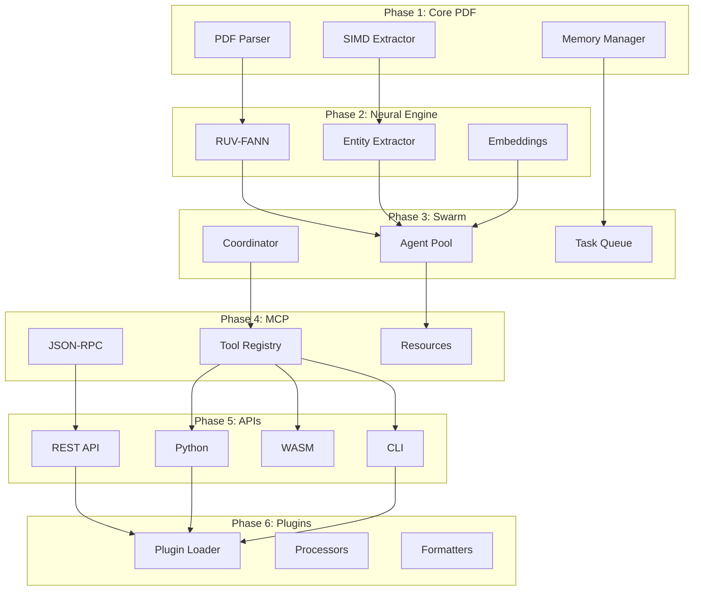

# NeuralDocFlow Phase Integration Matrix

## Phase Dependencies and Integration Points

### Integration Flow Diagram



## Integration Requirements Matrix

| From Phase | To Phase | Interface | Data Format | Performance Requirement |
|------------|----------|-----------|-------------|------------------------|
| Phase 1 | Phase 2 | `Document` struct | Binary/JSON | < 10ms serialization |
| Phase 1 | Phase 3 | `TextBlock[]` array | Shared memory | Zero-copy transfer |
| Phase 2 | Phase 3 | `EnrichedBlock` | MessagePack | < 5ms per block |
| Phase 2 | Phase 4 | Neural results | JSON | Streaming support |
| Phase 3 | Phase 4 | Swarm status | Protobuf | Real-time updates |
| Phase 3 | Phase 5 | Task results | JSON/Binary | Async callbacks |
| Phase 4 | Phase 5 | MCP protocol | JSON-RPC | < 10ms overhead |
| Phase 5 | Phase 6 | Plugin API | FFI/WASM | < 1ms call overhead |
| All | Monitoring | Metrics | Prometheus | < 1ms collection |

## Critical Integration Tests

### Phase 1 → 2: PDF to Neural
```rust
#[test]
fn test_pdf_to_neural_pipeline() {
    let doc = parse_pdf("test.pdf");
    let blocks = extract_text_blocks(&doc);
    let enriched = neural_processor.process(blocks);
    assert!(enriched.all(|b| b.confidence > 0.8));
}
```

### Phase 2 → 3: Neural to Swarm
```rust
#[test]
async fn test_neural_swarm_distribution() {
    let swarm = SwarmCoordinator::new(4);
    let tasks = create_neural_tasks(1000);
    let results = swarm.process_batch(tasks).await;
    assert_eq!(results.len(), 1000);
    assert!(results.all(|r| r.is_ok()));
}
```

### Phase 3 → 4: Swarm to MCP
```rust
#[test]
async fn test_swarm_mcp_coordination() {
    let mcp_server = McpServer::new();
    let swarm = SwarmCoordinator::new(8);
    mcp_server.register_swarm(&swarm);
    
    let status = mcp_server.call_tool("get_swarm_status", {}).await;
    assert_eq!(status["active_agents"], 8);
}
```

### Phase 4 → 5: MCP to APIs
```rust
#[test]
async fn test_mcp_api_integration() {
    let mcp = McpServer::start().await;
    let rest_api = RestApi::connect(&mcp);
    
    let response = rest_api.post("/process", pdf_data).await;
    assert_eq!(response.status(), 200);
}
```

### Phase 5 → 6: API to Plugins
```rust
#[test]
fn test_plugin_loading_via_api() {
    let plugin_manager = PluginManager::new();
    let custom_processor = plugin_manager.load("custom.so");
    
    let result = rest_api.process_with_plugin(
        pdf_data, 
        custom_processor
    );
    assert!(result.is_ok());
}
```

## Performance Bottleneck Analysis

### Identified Bottlenecks and Mitigations

1. **PDF → Neural Handoff**
   - Bottleneck: Serialization of large documents
   - Mitigation: Shared memory, zero-copy transfers
   - Target: < 10ms for 1000-page document

2. **Neural Processing Queue**
   - Bottleneck: Single-threaded inference
   - Mitigation: Batch processing, GPU acceleration
   - Target: 1000 blocks/second throughput

3. **Swarm Coordination**
   - Bottleneck: Task scheduling overhead
   - Mitigation: Lock-free queues, work stealing
   - Target: < 1ms scheduling latency

4. **MCP Protocol**
   - Bottleneck: JSON serialization
   - Mitigation: MessagePack, streaming
   - Target: < 10KB overhead per request

5. **API Gateway**
   - Bottleneck: Connection pooling
   - Mitigation: Async I/O, connection reuse
   - Target: 10,000 concurrent connections

## Integration Success Metrics

### End-to-End Performance Targets

| Document Size | Processing Time | Memory Usage | Accuracy |
|--------------|----------------|--------------|----------|
| 10 pages | < 1 second | < 100MB | > 99% |
| 100 pages | < 7 seconds | < 500MB | > 98% |
| 1000 pages | < 60 seconds | < 2GB | > 97% |
| 10,000 pages | < 10 minutes | < 8GB | > 95% |

### Integration Health Indicators

1. **Data Flow Metrics**
   - Queue depths < 1000 items
   - Processing lag < 5 seconds
   - Error rate < 0.1%

2. **Resource Utilization**
   - CPU usage 60-80% (optimal)
   - Memory usage < 80% capacity
   - Network I/O < 1Gbps

3. **Quality Metrics**
   - Integration test pass rate > 99%
   - Performance regression < 5%
   - API compatibility 100%

## Risk Mitigation Strategies

### Technical Integration Risks

1. **Version Incompatibility**
   - Risk: Breaking changes between phases
   - Mitigation: Semantic versioning, contract tests
   - Monitoring: API compatibility checks

2. **Performance Degradation**
   - Risk: Cascading slowdowns
   - Mitigation: Circuit breakers, load shedding
   - Monitoring: End-to-end latency tracking

3. **Resource Exhaustion**
   - Risk: Memory leaks across boundaries
   - Mitigation: Resource pools, cleanup hooks
   - Monitoring: Memory profiling

4. **Data Corruption**
   - Risk: Encoding issues, truncation
   - Mitigation: Checksums, validation
   - Monitoring: Data integrity checks

### Organizational Risks

1. **Phase Dependencies**
   - Risk: Blocking on previous phase
   - Mitigation: Mock interfaces, parallel development
   - Tracking: Gantt chart with critical path

2. **Testing Complexity**
   - Risk: Insufficient integration testing
   - Mitigation: Dedicated integration test suite
   - Measurement: Coverage across boundaries

## Integration Checklist

### Before Phase Completion
- [ ] API contracts defined and documented
- [ ] Integration tests written and passing
- [ ] Performance benchmarks established
- [ ] Error handling implemented
- [ ] Monitoring instrumentation added
- [ ] Documentation updated

### During Integration
- [ ] Contract compatibility verified
- [ ] Performance targets met
- [ ] Resource usage within limits
- [ ] Error rates acceptable
- [ ] Monitoring dashboards live
- [ ] Rollback procedures tested

### Post-Integration
- [ ] End-to-end tests passing
- [ ] Performance regression < 5%
- [ ] No memory leaks detected
- [ ] API compatibility maintained
- [ ] Documentation complete
- [ ] Handoff to next phase

## Continuous Integration Strategy

### Build Pipeline
```yaml
stages:
  - unit-test
  - integration-test
  - performance-test
  - security-scan
  - deploy-staging
  - e2e-test
  - deploy-production

integration-test:
  script:
    - cargo test --features integration
    - ./scripts/test-phase-boundaries.sh
  artifacts:
    reports:
      - target/integration-test-results.xml
```

### Monitoring Dashboard
- Phase completion status
- Integration test results
- Performance metrics
- Resource utilization
- Error rates by phase
- API compatibility matrix

## Conclusion

The success of NeuralDocFlow depends on seamless integration between phases. This matrix provides:

1. Clear integration points and data flows
2. Measurable success criteria
3. Risk identification and mitigation
4. Comprehensive testing strategy
5. Continuous monitoring approach

Each phase must validate its integration points before proceeding to ensure the complete system meets performance, reliability, and quality targets.