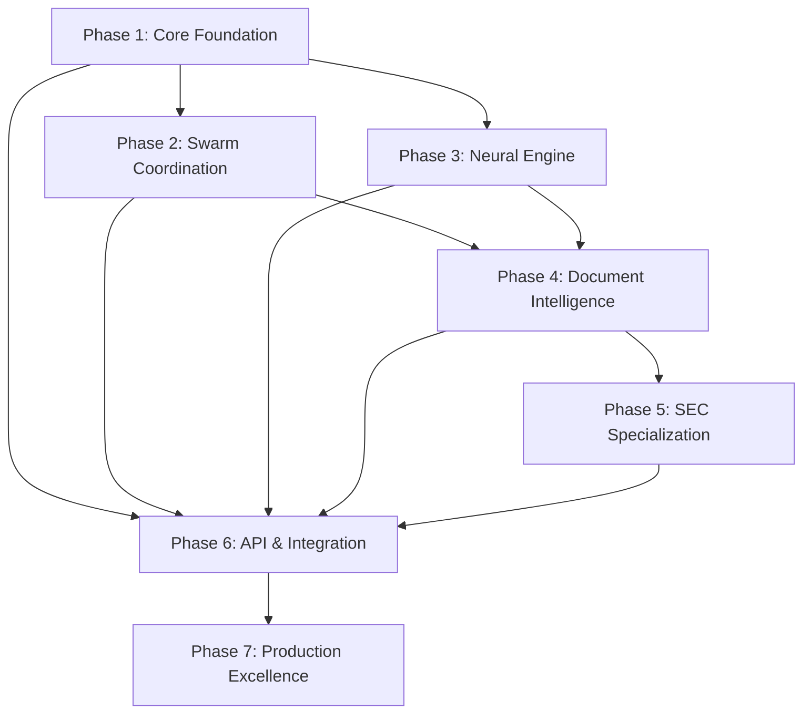

# NeuralDocFlow Architecture Phases

## Overview

NeuralDocFlow is built as a modular, phase-based system where each phase provides independently testable functionality that builds upon previous phases. This Lego-block approach ensures clean interfaces, testability, and incremental complexity.

## Architecture Principles

1. **Modular Independence**: Each phase can run standalone with mock interfaces
2. **Clear Contracts**: Well-defined APIs between phases
3. **Progressive Enhancement**: Each phase adds capabilities without breaking previous ones
4. **Test-First Design**: Every phase includes comprehensive test suites
5. **Performance Baseline**: Each phase establishes performance benchmarks
6. **Library Leverage**: Leverage imported libraries. Avoid writing code when libraries perform the function.

## Phase Architecture

### Phase 1: Core Foundation (Rust PDF Processing)
**Goal**: Establish rock-solid PDF processing foundation

**Components**:
- PDF Parser Engine (based on pdf-extract/lopdf)
- Text Extraction Pipeline
- Layout Analysis Module
- Metadata Extractor
- Error Handling Framework

**Interfaces**:
```rust
pub trait DocumentProcessor {
    fn extract_text(&self, pdf_bytes: &[u8]) -> Result<DocumentContent>;
    fn extract_metadata(&self, pdf_bytes: &[u8]) -> Result<DocumentMetadata>;
    fn extract_layout(&self, pdf_bytes: &[u8]) -> Result<DocumentLayout>;
}
```

**Test Targets**:
- 100+ PDF samples (various formats, sizes, complexities)
- Performance: < 100ms for 10-page document
- Memory usage: < 50MB for typical documents

### Phase 2: Swarm Coordination (Multi-Agent Infrastructure)
**Goal**: Enable distributed processing with agent coordination

**Components**:
- Agent Spawner & Lifecycle Manager
- Message Bus (tokio channels)
- Task Distribution Engine
- Coordination Protocol
- State Synchronization

**Interfaces**:
```rust
pub trait SwarmCoordinator {
    fn spawn_agent(&mut self, agent_type: AgentType) -> AgentId;
    fn distribute_task(&mut self, task: ProcessingTask) -> TaskHandle;
    fn aggregate_results(&mut self, task_id: TaskId) -> Result<ProcessingResult>;
}
```

**Test Targets**:
- Spawn 10+ agents without resource contention
- Process 100 documents concurrently
- Fault tolerance: handle 20% agent failure rate

### Phase 3: Neural Engine (RUV-FANN Integration)
**Goal**: Add neural network capabilities for intelligent processing

**Components**:
- RUV-FANN Rust Bindings
- Neural Network Manager
- Training Pipeline
- Model Serialization
- Inference Engine

**Interfaces**:
```rust
pub trait NeuralEngine {
    fn train_model(&mut self, training_data: &TrainingSet) -> ModelId;
    fn classify_content(&self, content: &[f32]) -> Classification;
    fn extract_patterns(&self, features: &FeatureSet) -> PatternSet;
}
```

**Test Targets**:
- Train models with 10k+ samples
- Inference speed: < 10ms per classification
- Model accuracy: > 95% on test set

### Phase 4: Document Intelligence (Transformer Models)
**Goal**: Advanced NLP understanding using transformer models

**Components**:
- Transformer Model Loader (ONNX Runtime)
- Tokenization Pipeline
- Embedding Generator
- Semantic Analysis Engine
- Entity Recognition System

**Interfaces**:
```rust
pub trait DocumentIntelligence {
    fn generate_embeddings(&self, text: &str) -> Vec<f32>;
    fn extract_entities(&self, content: &DocumentContent) -> EntitySet;
    fn analyze_semantics(&self, document: &Document) -> SemanticAnalysis;
}
```

**Test Targets**:
- Process 1000+ tokens/second
- Entity extraction F1 score: > 0.9
- Memory footprint: < 500MB with loaded models

### Phase 5: SEC Specialization (Financial Extraction)
**Goal**: Domain-specific extraction for SEC filings

**Components**:
- SEC Filing Classifier
- Financial Table Extractor
- XBRL Tag Mapper
- Regulatory Section Identifier
- Financial Metric Calculator

**Interfaces**:
```rust
pub trait SECProcessor {
    fn identify_filing_type(&self, document: &Document) -> FilingType;
    fn extract_financial_tables(&self, content: &DocumentContent) -> Vec<FinancialTable>;
    fn map_to_xbrl(&self, data: &FinancialData) -> XBRLDocument;
}
```

**Test Targets**:
- Correctly identify 100% of standard filing types
- Extract 95%+ of financial tables accurately
- XBRL mapping compliance: 100%

### Phase 6: API & Integration (Python Bindings)
**Goal**: Expose functionality through high-level APIs

**Components**:
- PyO3 Python Bindings
- REST API Server (Actix Web)
- GraphQL Interface
- Streaming API (WebSocket)
- SDK Generation

**Interfaces**:
```python
class NeuralDocFlow:
    def process_document(self, pdf_path: str) -> DocumentResult
    def batch_process(self, pdf_paths: List[str]) -> List[DocumentResult]
    def train_custom_model(self, training_data: TrainingData) -> Model
```

**Test Targets**:
- API latency: < 50ms overhead
- Concurrent requests: 1000+ RPS
- Python SDK coverage: 100% of Rust API

### Phase 7: Production Excellence (Optimization & Monitoring)
**Goal**: Production-ready system with enterprise features

**Components**:
- Performance Profiler
- Distributed Tracing (OpenTelemetry)
- Metrics Collection (Prometheus)
- Auto-scaling Engine
- Deployment Orchestration

**Interfaces**:
```rust
pub trait ProductionMonitor {
    fn collect_metrics(&self) -> MetricsSnapshot;
    fn optimize_performance(&mut self, profile: &PerformanceProfile);
    fn scale_resources(&mut self, load: &SystemLoad) -> ScalingDecision;
}
```

**Test Targets**:
- 99.9% uptime SLA
- Auto-scale from 10 to 1000 RPS
- Resource efficiency: < $0.01 per document

## Phase Dependencies



## Implementation Timeline

- **Weeks 1-2**: Phase 1 (Core Foundation)
- **Weeks 3-4**: Phase 2 (Swarm Coordination)
- **Weeks 5-6**: Phase 3 (Neural Engine)
- **Weeks 7-8**: Phase 4 (Document Intelligence)
- **Weeks 9-10**: Phase 5 (SEC Specialization)
- **Weeks 11-12**: Phase 6 (API & Integration)
- **Weeks 13-14**: Phase 7 (Production Excellence)

## Success Metrics

1. **Performance**: Process 10K pages/minute on single node
2. **Accuracy**: 98%+ extraction accuracy on SEC filings
3. **Scalability**: Linear scaling up to 100 nodes
4. **Reliability**: 99.9% uptime with automatic recovery
5. **Cost**: < $0.001 per page processed