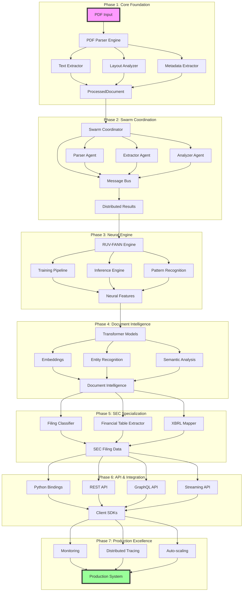
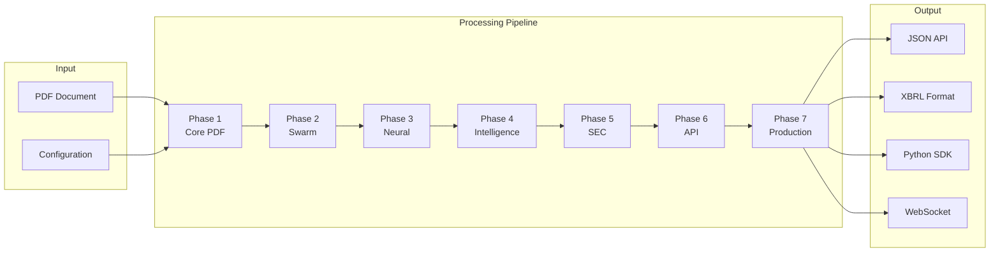
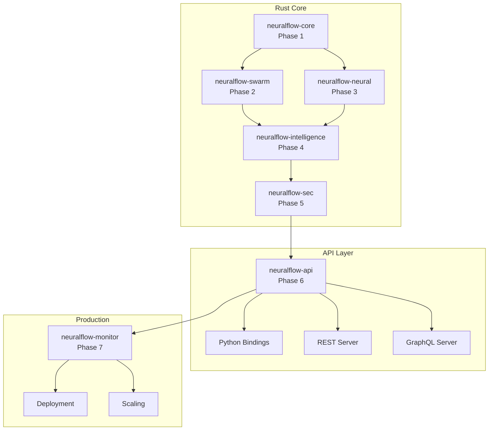
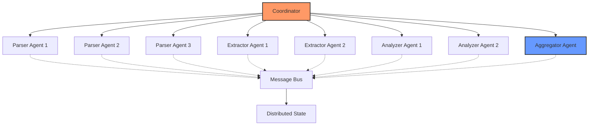
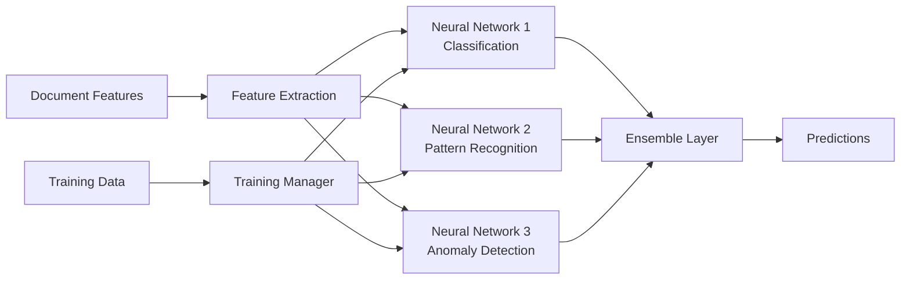
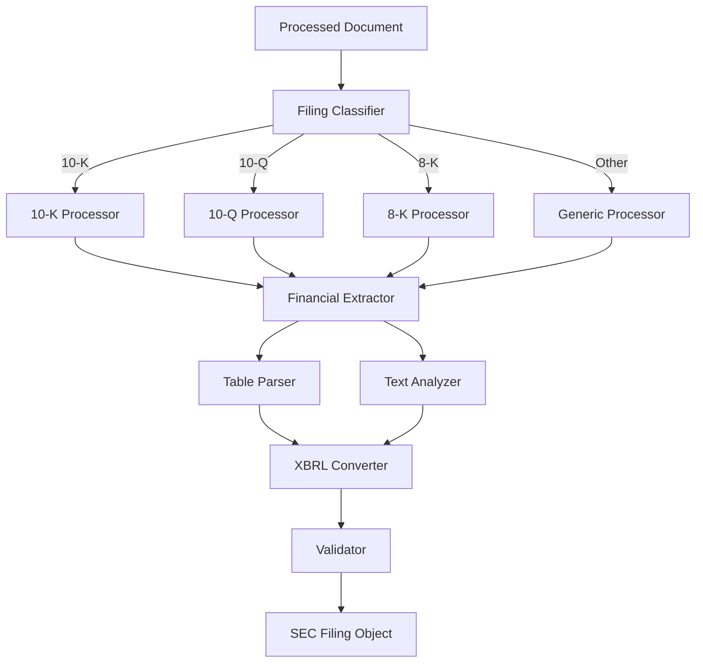
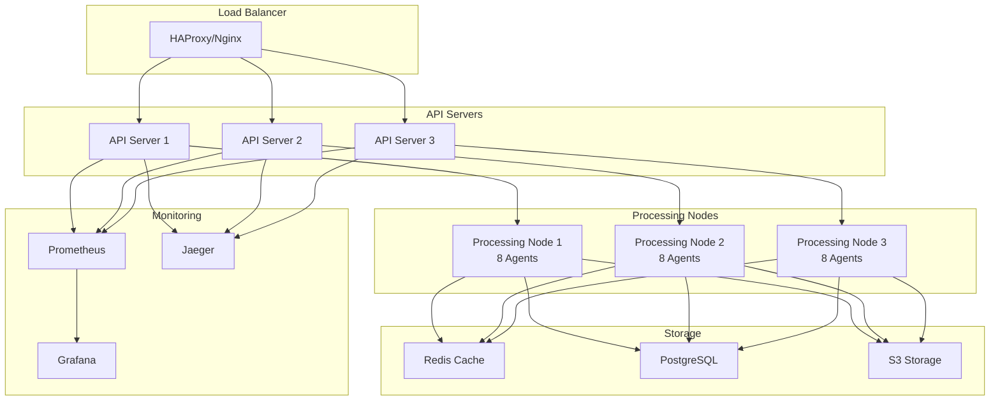
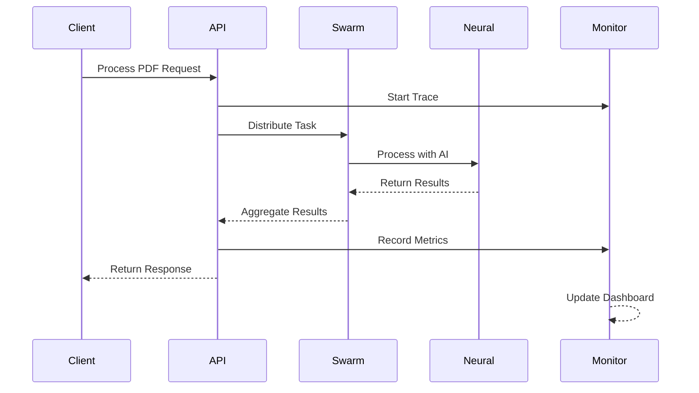
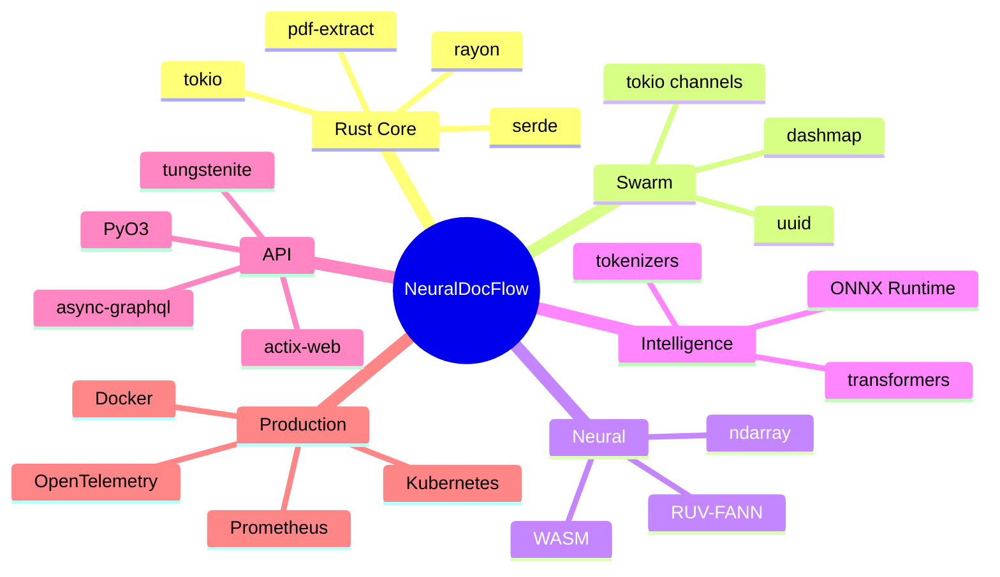

# NeuralDocFlow Architecture Diagram

## System Overview

## Data Flow Architecture

## Component Architecture

## Swarm Topology (Phase 2)

## Neural Architecture (Phase 3)

## SEC Processing Pipeline (Phase 5)

## Deployment Architecture (Phase 7)

## Performance Metrics Flow

## Technology Stack

