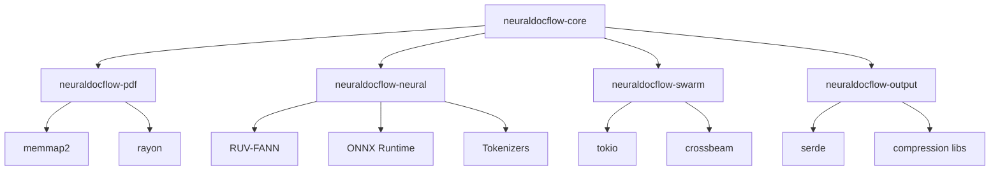

# NeuralDocFlow Requirements Analysis

## Executive Summary

Based on the architecture analysis, NeuralDocFlow is a high-performance, pure Rust document processing system leveraging neural networks for intelligent information extraction. This requirements analysis identifies functional and non-functional requirements, dependencies, success criteria, and risk factors for implementation.

## 1. Functional Requirements

### 1.1 Core PDF Parser Module (`neuraldocflow-pdf`)

#### Primary Functions:
- **FR-PDF-001**: Zero-copy PDF parsing using memory-mapped files
- **FR-PDF-002**: SIMD-accelerated text extraction on x86_64 architectures
- **FR-PDF-003**: Parallel page processing using Rayon
- **FR-PDF-004**: Memory pool management for efficient allocation
- **FR-PDF-005**: Document structure preservation during parsing
- **FR-PDF-006**: Metadata extraction from PDF documents

#### Acceptance Criteria:
- Parse PDFs without loading entire file into memory
- Extract text with 99.9% accuracy for standard PDFs
- Process pages in parallel with linear scaling
- Support PDFs up to 10GB in size
- Maintain page order and structure information

### 1.2 Neural Processing Layer (`neuraldocflow-neural`)

#### Primary Functions:
- **FR-NEU-001**: ONNX model loading and management
- **FR-NEU-002**: Batch inference processing
- **FR-NEU-003**: Embedding generation and caching
- **FR-NEU-004**: RUV-FANN network integration
- **FR-NEU-005**: GPU acceleration support (CUDA/TensorRT)
- **FR-NEU-006**: Model quantization (INT8, FP16)

#### Acceptance Criteria:
- Load and run LayoutLMv3, FinBERT, and custom models
- Process batches with <100ms latency per batch
- Cache embeddings with 90%+ hit rate
- Support dynamic model loading/unloading
- Achieve 2-4x speedup with quantization

### 1.3 Swarm Coordination Module (`neuraldocflow-swarm`)

#### Primary Functions:
- **FR-SWM-001**: Agent lifecycle management
- **FR-SWM-002**: Task distribution and load balancing
- **FR-SWM-003**: Inter-agent communication via channels
- **FR-SWM-004**: Pipeline orchestration
- **FR-SWM-005**: Fault tolerance and recovery
- **FR-SWM-006**: Performance metrics collection

#### Acceptance Criteria:
- Spawn and manage up to 64 agents
- Distribute tasks with <5ms overhead
- Handle agent failures gracefully
- Scale linearly with agent count
- Provide real-time performance metrics

### 1.4 Output Serialization Module (`neuraldocflow-output`)

#### Primary Functions:
- **FR-OUT-001**: Multi-format serialization (JSON, CBOR, MessagePack, Parquet)
- **FR-OUT-002**: Compression support (Zstd, LZ4, Snappy)
- **FR-OUT-003**: Structured data output with confidence scores
- **FR-OUT-004**: Streaming output for large documents
- **FR-OUT-005**: Schema validation

#### Acceptance Criteria:
- Serialize documents with <10ms overhead
- Support streaming for documents >100MB
- Compress output by 60-80%
- Validate output against schemas
- Preserve all extracted information

## 2. Non-Functional Requirements

### 2.1 Performance Requirements

#### Processing Speed:
- **NFR-PERF-001**: Process 1000+ pages/second on modern hardware
- **NFR-PERF-002**: Achieve <100ms latency for single page processing
- **NFR-PERF-003**: Scale linearly up to 64 CPU cores
- **NFR-PERF-004**: Utilize 90%+ of available SIMD instructions
- **NFR-PERF-005**: Maintain consistent throughput under load

#### Memory Efficiency:
- **NFR-MEM-001**: O(1) memory usage for document size
- **NFR-MEM-002**: Memory pool reuse rate >80%
- **NFR-MEM-003**: Zero-copy operations for large buffers
- **NFR-MEM-004**: Bounded memory usage per agent
- **NFR-MEM-005**: Efficient garbage collection

### 2.2 Accuracy Requirements

#### Extraction Accuracy:
- **NFR-ACC-001**: 95%+ text extraction accuracy
- **NFR-ACC-002**: 90%+ entity recognition F1 score
- **NFR-ACC-003**: 85%+ table structure preservation
- **NFR-ACC-004**: 92%+ layout analysis accuracy
- **NFR-ACC-005**: <5% false positive rate for anomalies

### 2.3 Reliability Requirements

#### System Reliability:
- **NFR-REL-001**: 99.9% uptime for production deployments
- **NFR-REL-002**: Graceful degradation under resource constraints
- **NFR-REL-003**: Automatic recovery from transient failures
- **NFR-REL-004**: Data integrity preservation
- **NFR-REL-005**: Deterministic processing results

### 2.4 Scalability Requirements

#### Horizontal Scaling:
- **NFR-SCAL-001**: Support distributed processing across nodes
- **NFR-SCAL-002**: Dynamic agent scaling based on load
- **NFR-SCAL-003**: Efficient work distribution algorithms
- **NFR-SCAL-004**: Minimal coordination overhead
- **NFR-SCAL-005**: Support for heterogeneous hardware

## 3. Component Dependencies

### 3.1 Build Order and Dependencies

### 3.2 External Dependencies

#### Required Libraries:
1. **RUV-FANN** (v0.3+): Neural network operations
2. **ONNX Runtime** (v1.16+): Model inference
3. **Tokenizers** (v0.15+): Text tokenization
4. **Tokio** (v1.35+): Async runtime
5. **Rayon** (v1.8+): Data parallelism
6. **memmap2** (v0.9+): Memory-mapped files

#### Optional Dependencies:
1. **CUDA Toolkit** (v11.8+): GPU acceleration
2. **TensorRT** (v8.6+): Inference optimization
3. **Intel MKL**: CPU optimization

## 4. Success Criteria by Phase

### Phase 1: Foundation (Weeks 1-2)
- ✅ Core project structure established
- ✅ Basic PDF parsing operational
- ✅ Memory management framework implemented
- ✅ Unit test coverage >80%
- ✅ CI/CD pipeline configured

### Phase 2: Neural Integration (Weeks 3-4)
- ✅ ONNX Runtime integrated
- ✅ LayoutLMv3 model loading
- ✅ Basic inference pipeline working
- ✅ RUV-FANN custom networks integrated
- ✅ Performance benchmarks established

### Phase 3: Swarm Implementation (Weeks 5-6)
- ✅ Agent spawning and management
- ✅ Task distribution working
- ✅ Inter-agent communication established
- ✅ Load balancing operational
- ✅ Fault tolerance mechanisms in place

### Phase 4: Optimization (Weeks 7-8)
- ✅ SIMD operations implemented
- ✅ GPU acceleration functional
- ✅ Model quantization working
- ✅ Cache hit rate >90%
- ✅ Performance targets achieved

### Phase 5: Production Readiness (Weeks 9-10)
- ✅ Comprehensive error handling
- ✅ Monitoring and metrics
- ✅ Documentation complete
- ✅ Security audit passed
- ✅ Deployment automation ready

## 5. Risk Factors and Mitigation

### 5.1 Technical Risks

#### Risk: SIMD Implementation Complexity
- **Impact**: High - Core performance feature
- **Probability**: Medium
- **Mitigation**: 
  - Use `wide` crate for portable SIMD
  - Implement fallback scalar versions
  - Extensive testing on different architectures

#### Risk: GPU Memory Management
- **Impact**: High - Can cause OOM errors
- **Probability**: Medium
- **Mitigation**:
  - Implement memory pooling for GPU
  - Monitor GPU memory usage
  - Automatic fallback to CPU

#### Risk: Model Compatibility Issues
- **Impact**: Medium - Limited model support
- **Probability**: Low
- **Mitigation**:
  - Test with multiple ONNX versions
  - Implement model validation
  - Maintain compatibility matrix

### 5.2 Performance Risks

#### Risk: Cache Thrashing in Parallel Processing
- **Impact**: High - Severe performance degradation
- **Probability**: Medium
- **Mitigation**:
  - NUMA-aware memory allocation
  - Cache-aligned data structures
  - Profiling-guided optimization

#### Risk: Network Latency in Distributed Mode
- **Impact**: Medium - Reduced throughput
- **Probability**: High
- **Mitigation**:
  - Implement request batching
  - Use efficient serialization (MessagePack)
  - Local caching strategies

### 5.3 Operational Risks

#### Risk: Memory Leaks in Long-Running Processes
- **Impact**: High - System instability
- **Probability**: Low (Rust safety)
- **Mitigation**:
  - Regular memory profiling
  - Implement resource limits
  - Automatic restart mechanisms

## 6. Testing Requirements

### 6.1 Unit Testing
- **Coverage Target**: 85%+
- **Focus Areas**:
  - Memory safety in unsafe blocks
  - Edge cases in parsing
  - Neural network accuracy
  - Concurrent operations

### 6.2 Integration Testing
- **Test Scenarios**:
  - End-to-end document processing
  - Multi-model pipelines
  - Swarm coordination
  - Error recovery paths

### 6.3 Performance Testing
- **Benchmarks**:
  - Throughput under various loads
  - Latency percentiles (p50, p95, p99)
  - Memory usage patterns
  - GPU utilization

### 6.4 Stress Testing
- **Scenarios**:
  - Maximum document size (10GB)
  - Concurrent processing (1000+ documents)
  - Agent failure simulation
  - Resource exhaustion

## 7. Security Requirements

### 7.1 Input Validation
- **REQ-SEC-001**: Validate PDF structure before processing
- **REQ-SEC-002**: Sanitize extracted text
- **REQ-SEC-003**: Limit resource consumption per document
- **REQ-SEC-004**: Prevent path traversal in file operations

### 7.2 Memory Safety
- **REQ-SEC-005**: Audit all unsafe blocks
- **REQ-SEC-006**: Bounds checking in SIMD operations
- **REQ-SEC-007**: Secure memory pooling
- **REQ-SEC-008**: Clear sensitive data after use

## 8. Monitoring and Observability

### 8.1 Metrics to Track
- Document processing rate
- Error rates by component
- Memory usage trends
- GPU utilization
- Cache hit rates
- Agent health status

### 8.2 Logging Requirements
- Structured logging (JSON)
- Configurable log levels
- Request tracing
- Error context preservation
- Performance profiling data

## 9. Documentation Requirements

### 9.1 API Documentation
- Rust doc comments for all public APIs
- Usage examples for each module
- Performance characteristics
- Error handling guidelines

### 9.2 Deployment Documentation
- System requirements
- Configuration options
- Deployment architectures
- Troubleshooting guide

## 10. Compliance and Standards

### 10.1 Code Quality
- Rust clippy compliance
- Consistent formatting (rustfmt)
- No unsafe code without justification
- Comprehensive error handling

### 10.2 Performance Standards
- Benchmarks for each component
- Regression testing
- Performance budgets
- Optimization documentation

## Conclusion

This requirements analysis provides a comprehensive foundation for implementing NeuralDocFlow. The modular architecture, clear dependencies, and well-defined success criteria enable systematic development while the identified risks and mitigation strategies ensure project success. The emphasis on performance, safety, and scalability aligns with the goal of creating a production-ready document processing system.